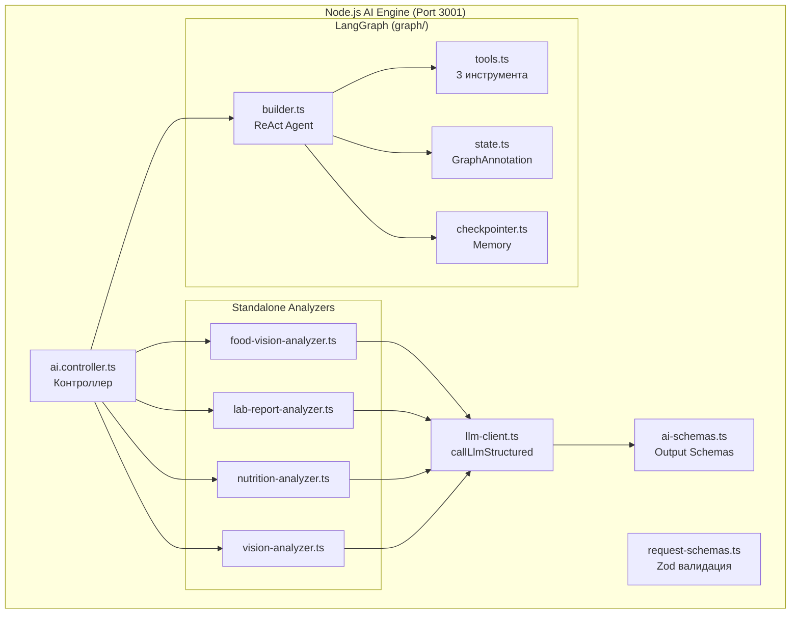
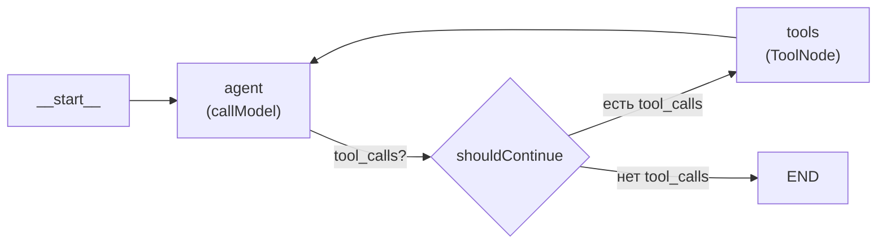
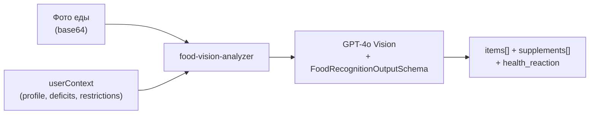
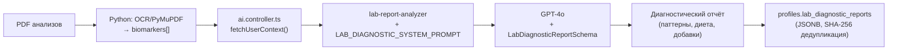

# VITOGRAPH — AI Pipeline Documentation

> **Дата актуальности:** 5 марта 2026 (Phase 53f)
>
> Документация AI/LLM пайплайна: LangGraph, GPT-4o, structured outputs, детерминированные нормы.

---

## 1. Обзор AI-архитектуры



---

## 2. LangGraph: ReAct Agent

Файл: [`builder.ts`](file:///c:/project/VITOGRAPH/apps/api/src/ai/src/graph/builder.ts)

### 2.1 Архитектура графа



**Модель:** `gpt-4o-mini` (temperature: 0.2)

### 2.2 Оптимизации в `callModel`

1. **Token explosion prevention:** Только ПОСЛЕДНИЙ SystemMessage сохраняется (LangGraph добавляет новый на каждый запрос). Конвенционные сообщения обрезаются до 20 последних.
2. **Deduplication interceptor (Phase 33.2):** Если LLM возвращает несколько `log_meal` tool_calls с одинаковым `food_name + weight_g`, дубликаты отсеиваются. Решает баг 10x дублирования.

### 2.3 State (GraphAnnotation)

Файл: [`state.ts`](file:///c:/project/VITOGRAPH/apps/api/src/ai/src/graph/state.ts)

| Поле             | Тип                   | Описание                                           |
| :--------------- | :-------------------- | :------------------------------------------------- |
| `messages`       | `BaseMessage[]`       | История беседы (reducer: `messagesStateReducer`)   |
| `medicalContext` | `Record<string, any>` | Медицинский контекст (биомаркеры, данные здоровья) |

### 2.4 Tools (Инструменты)

Файл: [`tools.ts`](file:///c:/project/VITOGRAPH/apps/api/src/ai/src/graph/tools.ts)

| Tool                  | Описание                                                            | Целевая таблица              |
| :-------------------- | :------------------------------------------------------------------ | :--------------------------- |
| `calculate_norms`     | Расчёт динамической нормы биомаркера через Python Core API          | — (прокси к Python)          |
| `update_user_profile` | Точечное обновление ключа в `lifestyle_markers` JSONB               | `profiles.lifestyle_markers` |
| `log_meal`            | Логирование приёма пищи с КБЖУ, микронутриентами и оценкой качества | `meal_logs`, `meal_items`    |

**Сигнатура `log_meal`:**
```
meal_type: breakfast|lunch|dinner|snack|drink
food_name: string
weight_g: number
calories, protein_g, fat_g, carbs_g: number
meal_quality_score: 0-100
meal_quality_reason: string (Russian)
micronutrients: {
  vitamin_a_mcg, vitamin_c_mg, iron_mg,
  calcium_mg, vitamin_d_mcg, vitamin_b12_mcg,
  zinc_mg, magnesium_mg, folate_mcg,
  selenium_mcg, potassium_mg, sodium_mg,
  vitamin_e_mg, phosphorus_mg, omega3_g
}
```

### 2.5 Checkpointer (Память)

Файл: [`checkpointer.ts`](file:///c:/project/VITOGRAPH/apps/api/src/ai/src/graph/checkpointer.ts)

Используется `MemorySaver` для хранения состояния графа в памяти между запросами. `threadId` привязывает беседу к конкретному пользователю/сессии.

---

## 3. Standalone Analyzers (без LangGraph)

### 3.1 Food Vision Analyzer

Файл: [`food-vision-analyzer.ts`](file:///c:/project/VITOGRAPH/apps/api/src/ai/src/graph/food-vision-analyzer.ts)



**Процесс:**
1. Получает `imageUrl` (публичный URL из Supabase Storage) и `userContext` (сериализованный контекст пользователя)
2. Формирует системный промпт: правила КБЖУ расчёта (USDA), оценки качества (0-100), правила трекинга БАДов (антагонисты)
3. Вызывает `callLlmStructured(GPT-4o, FoodRecognitionOutputSchema)`
4. Возвращает: продукты с нутриентами + БАДы с active_ingredients + реакция AI-друга

**Fallback (при ошибке):**
```json
{
  "items": [{ "name_ru": "Не распознано", "calories_kcal": 0, ... }],
  "supplements": [],
  "health_reaction": "Не удалось проанализировать фото.",
  "reaction_type": "neutral"
}
```

---

### 3.2 Lab Report Analyzer

Файл: [`lab-report-analyzer.ts`](file:///c:/project/VITOGRAPH/apps/api/src/ai/src/graph/lab-report-analyzer.ts)



**Токенизация:** ~24,000 токенов за анализ (18-20k системный промпт + 1-2k контекст + входные биомаркеры).

---

### 3.3 Vision Analyzer (Somatic)

Файл: [`vision-analyzer.ts`](file:///c:/project/VITOGRAPH/apps/api/src/ai/src/graph/vision-analyzer.ts)

Анализ фото ногтей/кожи/языка → `SomaticDiagnosticsOutputSchema`.

---

### 3.4 Nutrition Analyzer

Файл: [`nutrition-analyzer.ts`](file:///c:/project/VITOGRAPH/apps/api/src/ai/src/graph/nutrition-analyzer.ts)

AI-анализ текстового описания еды (без фото) → нутриенты.

---

## 4. Zod Output Schemas (ai-schemas.ts)

Файл: [`ai-schemas.ts`](file:///c:/project/VITOGRAPH/apps/api/src/ai/src/ai-schemas.ts) (436 строк)

| Schema                           | Назначение                                                             | Используется в           |
| :------------------------------- | :--------------------------------------------------------------------- | :----------------------- |
| `PsychologicalOutputSchema`      | CBT-ответ AI-друга (strategy, recommendations, confidence)             | `handleChat`             |
| `CorrelationOutputSchema`        | Корреляции еда-симптом                                                 | `handleAnalyze`          |
| `DiagnosticOutputSchema`         | Диагностические гипотезы + рекомендуемые тесты                         | `handleDiagnose`         |
| `SomaticDiagnosticsOutputSchema` | Маркеры с фото тела (markers[], interpretation, confidence)            | `handleAnalyzeSomatic`   |
| `FoodRecognitionOutputSchema`    | Продукты + БАДы + реакция AI (items[], supplements[], health_reaction) | `handleAnalyzeFood`      |
| `LabDiagnosticReportSchema`      | Полный диагностический отчёт по анализам крови                         | `handleAnalyzeLabReport` |

---

## 5. Контекст пользователя (ai.controller.ts)

### 5.1 `fetchUserContext(token, userId)`

Загружает из Supabase:
- `profiles` (с `lifestyle_markers`, `active_supplement_protocol`, `lab_diagnostic_reports`, `active_condition_knowledge_bases`)
- `test_results` (последние 50, с `biomarkers` JOIN)
- `meal_logs` (за сегодня)
- `supplement_logs` (за сегодня)

### 5.2 Context Formatters

| Функция                            | Что форматирует                                  |
| :--------------------------------- | :----------------------------------------------- |
| `formatTestResults()`              | Последние анализы крови для системного промпта   |
| `formatMealLogs()`                 | Сегодняшние приёмы пищи                          |
| `formatNutritionTargets()`         | Детерминированные нормы КБЖУ + микро (Phase 53f) |
| `formatTodayProgress()`            | Суммарное потребление нутриентов за сегодня      |
| `formatDietaryRestrictions()`      | Диетические ограничения из `lifestyle_markers`   |
| `formatActiveKnowledgeBases()`     | Активные медицинские базы знаний (диагнозы)      |
| `formatActiveSupplementProtocol()` | Текущий протокол БАДов                           |
| `formatTodaySupplements()`         | Логи приёма БАДов за сегодня                     |
| `formatLabDiagnosticReport()`      | Последний диагностический отчёт                  |

---

## 6. Детерминированные нормы (Phase 53f)

### `computeDeterministicMicros(profile, activeKnowledgeBases)`

Файл: [`ai.controller.ts`](file:///c:/project/VITOGRAPH/apps/api/src/ai/src/ai.controller.ts), строки 73-214

**Алгоритм:**
1. Начинается с базовых значений `BACKEND_BASE_MICRO_TARGETS` (17 микронутриентов)
2. Для каждого `active_condition_knowledge_bases`:
   - Извлекает `cofactors[]` из knowledge base
   - Маппит через `BACKEND_COFACTOR_MAP` (alias → каноническое имя)
   - Применяет множитель тяжести: `mild=1.15`, `moderate=1.30`, `significant=1.50`
3. Формирует `rationale` строку с объяснением применённых корректировок
4. Возвращает `{ micros, rationale }`

**Ключевое отличие от старого подхода:** 100% детерминированность (нет LLM-вызовов), стабильные результаты при каждом запросе.
