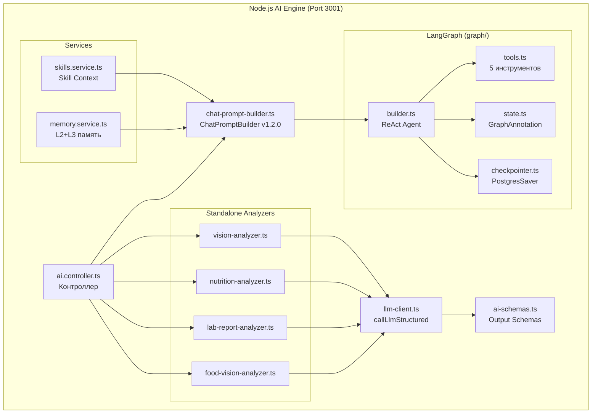
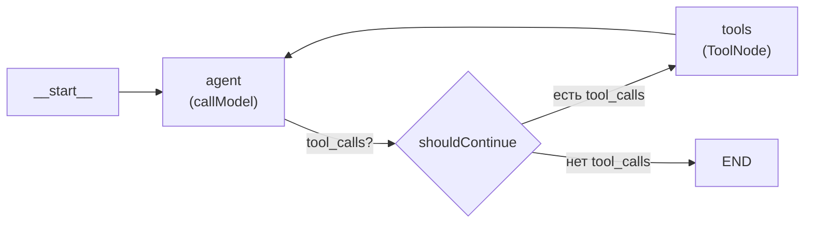
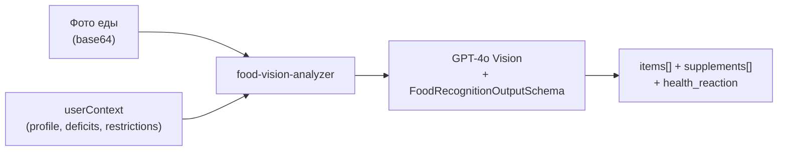
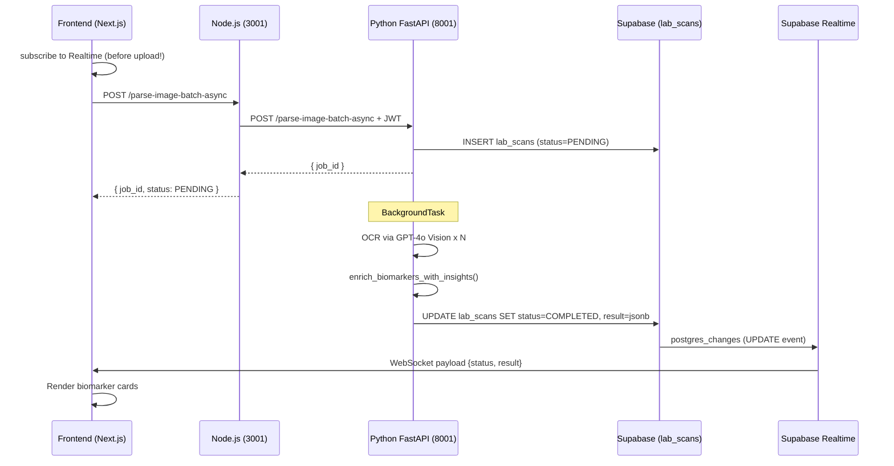

# VITOGRAPH — AI Pipeline Documentation

> **Дата актуальности:** 7 апреля 2026
>
> Документация AI/LLM пайплайна: LangGraph (фазы 1–5), ChatPromptBuilder, skills-система, 3-уровневая память.

---

## 1. Обзор AI-архитектуры



---

## 2. LangGraph: ReAct Agent

Файл: [`builder.ts`](file:///c:/project/VITOGRAPH/apps/api/src/ai/src/graph/builder.ts)

### 2.1 Архитектура графа



**Модели (актуально на апрель 2026):**

| Роль | Модель | Temperature | Назначение |
| :--- | :----- | :---------- | :--------- |
| **Primary (assistant)** | `gpt-5.4-mini-2026-03-17` | — *(reasoning, не поддерживает temperature)* | Режим `assistant` — основной чат-ассистент |
| **Diary** | `gpt-5.4-mini-2026-03-17` | — | Режим `diary` — логирование еды, tool-вызовы |
| **Vision / Lab** | `gpt-4o` | 0.2 | Standalone analyzers (food-vision, lab-report) |

> 📌 **DEPRECATED (2026-03-29):** Внешний прокси-роутер `api.ourzhishi.top/v1` и модель `gemini-3.1-pro-preview-thinking` полностью удалены. Все LLM-вызовы идут напрямую через OpenAI API.
> ⚠️ AI SDK выдаёт `Warning: temperature is not supported for reasoning models` — это ожидаемое поведение для `gpt-5.4-mini`, игнорируется.

### 2.2 Оптимизации в `callModel`

1. **Token explosion prevention:** Только ПОСЛЕДНИЙ SystemMessage сохраняется (LangGraph добавляет новый на каждый запрос). Конвенционные сообщения обрезаются до **12 последних** (ранее 20).
2. **Deduplication interceptor (Phase 33.2):** Если LLM возвращает несколько `log_meal` tool_calls с одинаковым `food_name + weight_g`, дубликаты отсеиваются. Решает баг 10x дублирования.
3. **sanitizeMessages() (Phase 55):** Перед отправкой в LLM, массив сообщений проходит через санитайзер, который удаляет:
   - Orphaned AI messages с `tool_calls` без соответствующих `tool` responses → заменяются на plain AIMessage
   - Orphaned `tool` responses без parent AI message → удаляются
   - При ошибке `INVALID_TOOL_RESULTS` при invoke — last-resort retry с полной зачисткой tool-истории
4. **Phase 54 — Vision nutritionalContext:** Если запрос содержит `nutritionalContext` в configurable, в начало сообщений инжектируется SystemMessage с готовыми нутриентами от Vision, чтобы LLM не пересчитывал их самостоятельно.

### 2.3 State (GraphAnnotation)

Файл: [`state.ts`](file:///c:/project/VITOGRAPH/apps/api/src/ai/src/graph/state.ts)

| Поле             | Тип                   | Описание                                           |
| :--------------- | :-------------------- | :------------------------------------------------- |
| `messages`       | `BaseMessage[]`       | История беседы (reducer: `messagesStateReducer`)   |
| `medicalContext` | `Record<string, any>` | Медицинский контекст (биомаркеры, данные здоровья) |

### 2.4 Tools (Инструменты)

Файл: [`tools.ts`](file:///c:/project/VITOGRAPH/apps/api/src/ai/src/graph/tools.ts)

| Tool                       | Описание                                                            | Целевая таблица              |
| :------------------------- | :------------------------------------------------------------------ | :--------------------------- |
| `calculate_biomarker_norms`| Расчёт динамической нормы биомаркера через Python Core API          | — (прокси к Python)          |
| `update_user_profile`      | Точечное обновление ключа в `lifestyle_markers` JSONB               | `profiles.lifestyle_markers` |
| `log_meal`                 | Логирование приёма пищи с КБЖУ, микронутриентами и оценкой качества | `meal_logs`, `meal_items`    |
| `log_supplement_intake`    | Логирование приёма БАДа из протокола пользователя                   | `supplement_logs`            |
| `get_today_diary_summary`  | Получение дневника за сегодня (калории, макросы, список блюд)       | `meal_logs` (read-only)      |
| `manage_health_goals`      | FSM-управление целями здоровья (add, remove, pause, resume, advance_step) | `user_active_skills`         |
| `log_assistant_action`     | Внутренний: логирует рекомендации ассистента для anti-repetition     | `user_memory_vectors`        |

**Разделение по режимам:**
- **assistant mode:** `calculate_biomarker_norms`, `update_user_profile`, `get_today_diary_summary`, `manage_health_goals`, `log_assistant_action`
- **diary mode:** `calculate_biomarker_norms`, `update_user_profile`, `log_meal`, `log_supplement_intake`, `get_today_diary_summary`, `log_assistant_action`

**Сигнатура `log_meal`:**
```
meal_type: breakfast|lunch|dinner|snack|drink
food_name: string
weight_g: number
calories, protein_g, fat_g, carbs_g: number
meal_quality_score: 0-100
meal_quality_reason: string (Russian)
micronutrients: {
  vitamin_a_mcg, vitamin_c_mg, iron_mg,
  calcium_mg, vitamin_d_mcg, vitamin_b12_mcg,
  zinc_mg, magnesium_mg, folate_mcg,
  selenium_mcg, potassium_mg, sodium_mg,
  vitamin_e_mg, phosphorus_mg, omega3_g
}
```

**Сигнатура `log_supplement_intake`:**
```
supplement_name: string (e.g. "Omega-3", "Zinc")
dosage: string (e.g. "1000mg", "1 pill")
was_on_time: boolean
```

**Сигнатура `manage_health_goals`:**
```
action: add|add_with_plan|remove|pause|resume|advance_step
skill_name: string
steps?: [{ order, title }] (for add_with_plan)
diagnosis_basis?: { marker_slug, pattern, biomarker_list }
```

**Сигнатура `get_today_diary_summary`:**
```
dummy: string? (пустой параметр для совместимости)
→ Возвращает JSON: {
  summary_date, total_calories_today, total_protein_today,
  total_fat_today, total_carbs_today,
  meals: [{ meal_type, time, calories, items[] }]
}
```

### 2.5 Checkpointer (Память)

Файл: [`checkpointer.ts`](file:///c:/project/VITOGRAPH/apps/api/src/ai/src/graph/checkpointer.ts)

**Режим:** `PostgresSaver` (persistent) — хранит checkpoints в Supabase PostgreSQL. `threadId` привязывает беседу к конкретному пользователю/сессии.

- При наличии `SUPABASE_DB_URL` → `PostgresSaver` (persistent, checkpoints выживают перезапуск сервера)
- При отсутствии → `MemorySaver` (fallback, in-memory, dev mode)
- Pruning (weekly SQL): оставляет последние 50 checkpoints на thread

См. подробности в [`docs/memory_architecture.md`](./memory_architecture.md).

---

## 3. Standalone Analyzers (без LangGraph)

### 3.1 Food Vision Analyzer

Файл: [`food-vision-analyzer.ts`](file:///c:/project/VITOGRAPH/apps/api/src/ai/src/graph/food-vision-analyzer.ts)



**Процесс:**
1. Получает `imageUrl` (публичный URL из Supabase Storage) и `userContext` (сериализованный контекст пользователя)
2. Формирует системный промпт: правила КБЖУ расчёта (USDA), оценки качества (0-100), правила трекинга БАДов (антагонисты)
3. Вызывает `callLlmStructured(GPT-4o, FoodRecognitionOutputSchema)`
4. Возвращает: продукты с нутриентами + БАДы с active_ingredients + реакция AI-друга

**Fallback (при ошибке):**
```json
{
  "items": [{ "name_ru": "Не распознано", "calories_kcal": 0, ... }],
  "supplements": [],
  "health_reaction": "Не удалось проанализировать фото.",
  "reaction_type": "neutral"
}
```

---

### 3.2 Lab Report Analyzer

Файл: [`lab-report-analyzer.ts`](file:///c:/project/VITOGRAPH/apps/api/src/ai/src/graph/lab-report-analyzer.ts)

#### Async OCR Pipeline (рекомендуемый путь для batch)



#### Последовательность статусов job:

```
PENDING → PROCESSING → COMPLETED (result заполнен)
                     → FAILED (error заполнен)
```

#### Sync Flow (одиночное фото / fallback)

```mermaid
flowchart LR
    INPUT["PDF / Фото анализов"] --> PYTHON["Python: OCR / GPT-4o Vision<br/>→ biomarkers[]"]
    PYTHON --> UI["MedicalResultsView<br/>Pause & Review"]
    UI --> CTRL["ai.controller.ts<br/>fetchUserContext()"]
    CTRL --> LRA["lab-report-analyzer<br/>+ Smart Coverage Prompt"]
    LRA --> GPT["GPT-4o<br/>maxOutputTokens: 16384"]
    GPT --> REPORT["Диагностический отчёт<br/>(паттерны, диета, добавки)"]
    REPORT --> DB["profiles.lab_diagnostic_reports<br/>(JSONB, SHA-256 дедупликация)"]
```



**Ключевые параметры:**
- **Семантический Кэш (biomarker_note_cache):** Перед вызовом LLM происходит поиск известных паттернов `(slug, flag)` в Supabase. Найденные описания инжектятся напрямую в промпт, сокращая размер контекста на 1000-2000 токенов и защищая от LLM-деградации.
- **Модель:** `gpt-4o` (temperature: 0.2)
- **maxOutputTokens:** 16384 (предотвращает обрезку больших отчётов)
- **timeoutMs:** 120000
- **Smart Coverage:** Аномальные маркеры получают детальный анализ, нормальные — краткий. Все маркеры обязательны.
- **Pause & Review:** Пользователь может отредактировать распознанные значения перед генерацией отчёта.
- **UI Feedback:** Пустые значения и нормы подсвечиваются красным (`border-rose-400`).

---

### 3.3 Vision Analyzer (Somatic)

Файл: [`vision-analyzer.ts`](file:///c:/project/VITOGRAPH/apps/api/src/ai/src/graph/vision-analyzer.ts)

Анализ фото ногтей/кожи/языка → `SomaticDiagnosticsOutputSchema`.

---

### 3.4 Nutrition Analyzer

Файл: [`nutrition-analyzer.ts`](file:///c:/project/VITOGRAPH/apps/api/src/ai/src/graph/nutrition-analyzer.ts)

AI-анализ текстового описания еды (без фото) → нутриенты.

---

## 4. Zod Output Schemas (ai-schemas.ts)

Файл: [`ai-schemas.ts`](file:///c:/project/VITOGRAPH/apps/api/src/ai/src/ai-schemas.ts)

| Schema                           | Назначение                                                             | Используется в           |
| :------------------------------- | :--------------------------------------------------------------------- | :----------------------- |
| `PsychologicalOutputSchema`      | CBT-ответ AI-друга (strategy, recommendations, confidence)             | `handleChat`             |
| `CorrelationOutputSchema`        | Корреляции еда-симптом                                                 | `handleAnalyze`          |
| `DiagnosticOutputSchema`         | Диагностические гипотезы + рекомендуемые тесты                         | `handleDiagnose`         |
| `SomaticDiagnosticsOutputSchema` | Маркеры с фото тела (markers[], interpretation, confidence)            | `handleAnalyzeSomatic`   |
| `FoodRecognitionOutputSchema`    | Продукты + БАДы + реакция AI (items[], supplements[], health_reaction) | `handleAnalyzeFood`      |
| `LabDiagnosticReportSchema`      | Полный диагностический отчёт по анализам крови                         | `handleAnalyzeLabReport` |

---

## 5. Контекст пользователя (ai.controller.ts)

### 5.1 `fetchUserContext(token, userId)`

Загружает из Supabase:
- `profiles` (с `lifestyle_markers`, `active_supplement_protocol`, `lab_diagnostic_reports`, `active_condition_knowledge_bases`)
- `test_results` (последние 50, с `biomarkers` JOIN)
- `meal_logs` (за сегодня)
- `supplement_logs` (за сегодня)

> **Внимание:** Фильтрация "за сегодня" (today) работает **сугубо с учетом `timezone` пользователя** (Timezone-Aware Day Boundaries) с помощью `getTzDayBoundaries()`. Это блокирует частую галлюцинацию AI, когда ужин "вчерашнего" дня ложился в сегодняшний расчет из-за разницы UTC.

### 5.2 Context Formatters

| Функция                            | Что форматирует                                  |
| :--------------------------------- | :----------------------------------------------- |
| `formatTestResults()`              | Последние анализы крови для системного промпта   |
| `formatMealLogs()`                 | Сегодняшние приёмы пищи                          |
| `formatNutritionTargets()`         | Детерминированные нормы КБЖУ + микро            |
| `formatTodayProgress()`            | Суммарное потребление нутриентов за сегодня      |
| `formatDietaryRestrictions()`      | Диетические ограничения из `lifestyle_markers`   |
| `formatActiveKnowledgeBases()`     | Активные медицинские базы знаний (диагнозы)      |
| `formatActiveSupplementProtocol()` | Текущий протокол БАДов                           |
| `formatTodaySupplements()`         | Логи приёма БАДов за сегодня                     |
| `formatLabDiagnosticReport()`      | Последний диагностический отчёт                  |

---

## 6. Детерминированные нормы

### `computeDeterministicMicros(profile, activeKnowledgeBases)`

Файл: [`ai.controller.ts`](file:///c:/project/VITOGRAPH/apps/api/src/ai/src/ai.controller.ts)

**Алгоритм:**
1. Начинается с базовых значений `BACKEND_BASE_MICRO_TARGETS` (17 микронутриентов)
2. Для каждого `active_condition_knowledge_bases`:
   - Извлекает `cofactors[]` из knowledge base
   - Маппит через `BACKEND_COFACTOR_MAP` (alias → каноническое имя)
   - Применяет множитель тяжести: `mild=1.15`, `moderate=1.30`, `significant=1.50`
3. Формирует `rationale` строку с объяснением применённых корректировок
4. Возвращает `{ micros, rationale }`

**Ключевое отличие:** 100% детерминированность (нет LLM-вызовов), стабильные результаты при каждом запросе.

---

## 7. Services

### 7.1 memory.service.ts

Отвечает за L2 (семантическую) и L3 (эмпатическую) память. Подробности см. [`memory_architecture.md`](./memory_architecture.md).

### 7.2 skills.service.ts

`fetchActiveSkills(userId, token)` — загружает до 3 активных целей здоровья из `user_active_skills` (status=`active`, ордер по priority).
Выполняется параллельно с `fetchUserContext()` и `fetchAdvancedMemoryContext()`.

Используется в:
- `ChatPromptBuilder.withActiveSkills()` — инжектирует только текущий шаг каждой цели
- `ChatPromptBuilder.withCoachingMode()` — MI coaching + specialist context
- `ChatPromptBuilder.withGoalManagement()` — FSM transition rules
