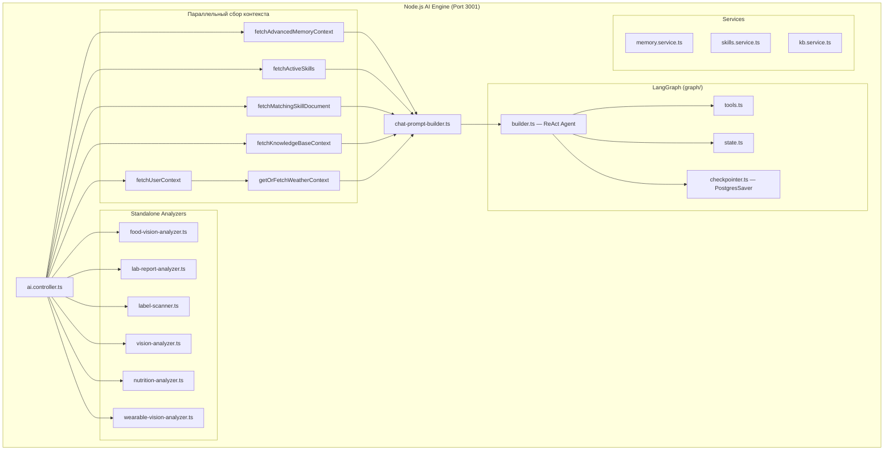
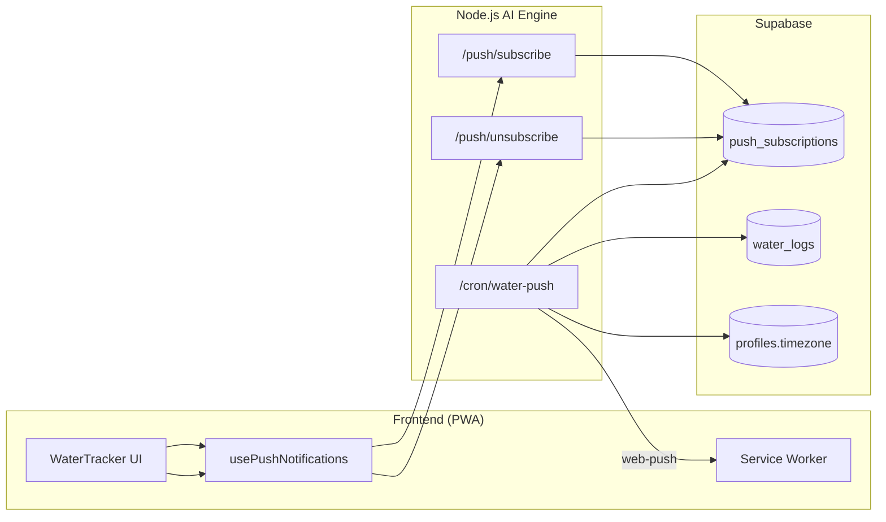

# VITOGRAPH — AI Pipeline

> **Дата актуальности:** 12 Мая 2026 (обновлено: Wearable Vision, Deterministic Targets)
>
> Документация AI/LLM пайплайна: LangGraph, модели, сервисы, инструменты.

---

## 1. Обзор архитектуры



---

## 2. LLM-модели

| Роль | Модель | Назначение |
| :--- | :----- | :--------- |
| **Chat (primary)** | `gpt-5.4-mini` | Режимы `assistant` и `diary` — основной ReAct Agent |
| **Chat (fallback)** | `gpt-4o-mini` | Fallback для обоих режимов при сбое primary |
| **Vision / Lab / Label / Wearables** | `gpt-5.4-mini` | Standalone analyzers (food-vision, lab-report, label-scanner, wearable-vision) |
| **Embeddings (Memory/Skills)** | `text-embedding-3-small` (384d) | Семантический поиск в episodic memory (PostgresSaver/MemVector) |
| **Embeddings (Knowledge Base)**| `gte-small` (Supabase.ai) | Вложенный поиск в Knowledge Base (проксируется через EF `kb-embed-query`) |

> ⚠️ **Примечание:** `gpt-5.4-mini` является reasoning-моделью и не поддерживает параметр `temperature`. AI SDK выдаёт предупреждение — это ожидаемое поведение, игнорируется.

---

## 3. LangGraph: ReAct Agent

Файл: `apps/api/src/ai/src/graph/builder.ts`

### 3.1 Граф исполнения

```
__start__ → agent (callModel) → shouldContinue?
                                    ├── есть tool_calls → tools (ToolNode) → agent
                                    └── нет tool_calls → END
```

### 3.2 Оптимизации в `callModel`

1. **Token management:** Только ПОСЛЕДНИЙ `SystemMessage` сохраняется (LangGraph добавляет новый при каждом вызове). История обрезается до **12 последних сообщений**.
2. **Deduplication:** Если LLM возвращает несколько `log_meal` tool_calls с одинаковым `food_name + weight_g`, дубликаты отсеиваются.
3. **sanitizeMessages():** Перед отправкой в LLM массив сообщений очищается:
   - Orphaned AI-сообщения с `tool_calls` без ответов → конвертируются в plain `AIMessage`
   - Orphaned `tool` responses без parent AI-сообщения → удаляются
   - При ошибке `INVALID_TOOL_RESULTS` — full retry с зачисткой tool-истории
4. **Vision nutritionalContext:** Если запрос содержит `nutritionalContext` в `configurable`, в начало сообщений инжектируется `SystemMessage` с нутриентами от Vision → AI не пересчитывает их самостоятельно.

### 3.3 State (GraphAnnotation)

| Поле | Тип | Описание |
| :--- | :-- | :------- |
| `messages` | `BaseMessage[]` | История диалога (reducer: `messagesStateReducer`) |
| `medicalContext` | `Record<string, any>` | Медицинский контекст (биомаркеры, данные здоровья) |

### 3.4 Checkpointer

Файл: `apps/api/src/ai/src/graph/checkpointer.ts`

- При наличии `SUPABASE_DB_URL` → `PostgresSaver` (persistent, checkpoints выживают перезапуск)
- При отсутствии → `MemorySaver` (fallback, in-memory, dev-mode)
- Pruning: weekly SQL, оставляет последние 50 checkpoints на thread

---

## 4. Инструменты LangGraph (tools.ts)

| Инструмент | Описание | Целевая таблица |
| :--------- | :------- | :-------------- |
| `calculate_biomarker_norms` | Персонализированные нормы биомаркера через Python Core API | — (прокси к Python) |
| `update_user_profile` | Обновление `lifestyle_markers` в JSONB | `profiles.lifestyle_markers` |
| `log_meal` | Логирование еды: GI + GL + response_type + 13 микронутриентов + quality score + `<meal_id/>` tag | `meal_logs`, `meal_items` |
| `log_supplement_intake` | Логирование БАДа из протокола | `supplement_logs` |
| `get_today_diary_summary` | Сводка дневника за сегодня (комбинированный гликемический отклик, список блюд) | `meal_logs` (read-only) |
| `manage_health_goals` | FSM-управление целями здоровья: add, add_with_plan, remove, pause, resume, advance_step. Max 3 active. Dedup по title. | `user_active_skills` |
| `log_assistant_action` | Внутренний (invisible): сохранение рекомендаций ассистента с dedup (cosine 0.85) | `user_memory_vectors` (type=assistant_action) |

Tools экспортируются в трёх наборах:
- `agentTools` — полный набор (7 tools)
- `assistantTools` — `calculate_biomarker_norms`, `update_user_profile`, `get_today_diary_summary`, `manage_health_goals`, `log_assistant_action`
- `diaryTools` — `calculate_biomarker_norms`, `update_user_profile`, `log_meal`, `log_supplement_intake`, `get_today_diary_summary`, `log_assistant_action`

---

## 5. Контекстный пайплайн (ai.controller.ts)

При каждом запросе `/api/v1/ai/chat` и `/api/v1/ai/chat/stream` параллельно выполняются:

```typescript
const [dbContext, [emotionalProfile, semanticMemories, pastActions], activeSkills, matchedSkill, kbContext] =
  await Promise.all([
    fetchUserContext(token, userId),
    fetchAdvancedMemoryContext(userId, message, token),
    fetchActiveSkills(userId, token),
    fetchMatchingSkillDocument(userId, message),
    fetchKnowledgeBaseContext(message, token),
  ]);

// Sequential (зависит от dbContext.profile):
const weatherData = await getOrFetchWeatherContext(dbContext.profile, userId);
```

### 5.1 `fetchUserContext(token, userId)`

Загружает из Supabase:
- `profiles` (с `lifestyle_markers`, `lab_diagnostic_reports`, `active_condition_knowledge_bases`)
- `test_results` (последние 50, с `biomarkers` JOIN)
- `meal_logs` (за сегодня, timezone-aware)
- `supplement_logs` (за сегодня)

> **Timezone-Aware Day Boundaries:** Фильтрация «за сегодня» работает с учётом `timezone` пользователя через `getTzDayBoundaries()`. Предотвращает галлюцинацию AI при разнице UTC.

### 5.2 `fetchAdvancedMemoryContext(userId, message, token)`

Файл: `services/memory.service.ts`

Параллельно выполняет:
1. **fetchEmotionalProfile** → `user_emotional_profile` (mood, trend, trust_level)
2. **fetchSemanticMemories** → RPC `match_user_memories` (pgvector, top-5, threshold=0.25)
3. **fetchPastActions** → `user_memory_vectors` (type='action', recent assistant actions)

Все ошибки проглатываются → возвращает `[null, null, null]` при сбое.

### 5.3 `fetchActiveSkills(userId, token)`

Файл: `services/skills.service.ts`

- Читает до 3 активных скиллов пользователя из `user_active_skills` (ordered by priority)
- Каждый скилл содержит: title, category, steps[], current_step_index
- Graceful degradation: null при ошибке

### 5.4 `fetchMatchingSkillDocument(userId, message)`

Файл: `services/skills.service.ts`

- Вызывает Edge Function `match-skill-context`
- Edge Function генерирует embedding (gte-small) и выполняет pgvector similarity search
- Возвращает наиболее релевантный skill document или null

### 5.5 `fetchKnowledgeBaseContext(message, token)`

Файл: `services/kb.service.ts`

- Для формирования вектора вопроса обращается к Edge Function прокси `kb-embed-query` (используется бесплатная модель `gte-small`).
- Выполняет Hybrid search (semantic + lexical) через RPC `hybrid_search_kb`
- RRF fusion, top-5 результатов (`p_top_k: 5`)
- Graceful degradation: null при ошибке или пустом результате.
- Формирует контекст в строгом формате "ЗНАНИЯ ДЛЯ СИНТЕЗА" без упоминания оригинальных названий книг во избежание плагиата.

База знаний: `kb_documents → kb_sections → kb_chunks`

---

## 6. ChatPromptBuilder

Файл: `apps/api/src/ai/src/prompts/chat-prompt-builder.ts`

Fluent builder, собирающий system prompt из секций с приоритетами:

| Приоритет | Секция | Режим | Примерный объём |
|:----------|:-------|:------|:----------------|
| P0 | `withPersona()` — core persona + правила + стоп-лист | Оба | ~3500 символов |
| P0 | `withProfile()` — профиль, ограничения, цели | Оба | ~500 символов |
| P0 | `withActiveSkills()` — goal journeys + **темпоральный предрасчёт** (📅 День X из Y) | Оба | ~800+ символов |
| P0 | `withGoalManagement()` — правила FSM маршрутов | Оба | ~800 символов |
| P0 | `withCoachingMode()` — MI coaching + specialist context | Assistant | ~600 символов |
| P0 | `withSkillDocument()` — персональный протокол (skill_document) | Оба | ~1200 символов |
| P0 | `withDiaryMode()` / `withAssistantMode()` — правила режима | По режиму | ~300 символов |
| P1 | `withEmotionalContext()` — Layer 3 памяти | Оба | ~300 символов |
| P1 | `withSemanticMemory()` — Layer 2 памяти (факты) | Оба | ~600 символов |
| P1 | `withPastActions()` — анти-повторы рекомендаций | Оба | ~400 символов |
| P1 | `withGlycemicTimeline()` — Инсулиновый Сёрфинг и гликемическая зона | Diary | ~800 символов |
| P1 | `withTodayProgress()` — сводка потребления за сегодня | Оба | ~600 символов |
| P1 | `withLabReport()` — диагностический отчёт | Assistant | ~2000 символов |
| P2 | `withMealLogs()` — детальный лог приёмов пищи | Diary | ~1500 символов |
| P2 | `withKnowledgeBases()` — активные диагнозы/базы знаний | Оба | ~800 символов |
| P2 | `withSupplementProtocol()` — протокол БАДов | Оба | ~600 символов |
| P2 | `withTodaySupplements()` — лог приёма БАДов | Оба | ~300 символов |
| P3 | `withWeatherAlert()` — погодный контекст | Оба | ~200 символов |

---

## 7. Standalone Analyzers

### 7.1 Food Vision Analyzer
Файл: `graph/food-vision-analyzer.ts`

Фото еды → `items[]` (GI, GL, вес, макро для вычислений, 13 микронутриентов) + `supplements[]` + `health_reaction`.
Модель: `gpt-5.4-mini` (vision). Schema: `FoodRecognitionOutputSchema`.

### 7.2 Lab Report Analyzer
Файл: `graph/lab-report-analyzer.ts`

Поддерживает **два режима:**
- **Sync:** единственное фото → немедленный отчёт
- **Async:** batch PDF/фото → BackgroundTask → Realtime updates (WebSocket)

Статусы async-job: `PENDING → PROCESSING → COMPLETED | FAILED`

Оптимизации:
1. **Semantic Cache:** перед LLM-вызовом ищет известные паттерны `(slug, flag)` в `biomarker_note_cache`. Сокращает контекст на 1000–2000 токенов.
2. `maxOutputTokens: 16384` — предотвращает обрезку больших отчётов.

### 7.3 Label Scanner
Файл: `graph/label-scanner.ts` *(новый)*

Анализ фото этикетки/состава продукта → вердикт (RED / YELLOW / GREEN) + расшифровка E-кодов + макронутриенты на 100г. Учитывает профиль здоровья (аллергии, диагнозы, диетические цели).
Модель: `gpt-5.4-mini`. Schema: `LabelScannerOutputSchema`.

### 7.4 Vision Analyzer (Somatic)
Файл: `graph/vision-analyzer.ts`

Фото ногтей/кожи/языка → `SomaticDiagnosticsOutputSchema` (markers[], interpretation, confidence).

### 7.5 Nutrition Analyzer
Файл: `graph/nutrition-analyzer.ts`

Текстовое описание еды (без фото) → нутриенты.

### 7.6 Wearable Vision Analyzer
Файл: `graph/wearable-vision-analyzer.ts` *(новый)*

Фото скриншотов с Apple Health, Garmin, Oura и других трекеров → `WearableOCRSchema` (detectedCategory, metrics). Распознает показатели сна, кардио, состава тела и метаболизма.
Модель: `gpt-5.4-mini` (vision).

---

## 8. Детерминированные нормы микронутриентов

Файл: `ai.controller.ts` — `computeDeterministicMicros(profile, activeKnowledgeBases)`

**Алгоритм:**
1. Базовые значения `BACKEND_BASE_MICRO_TARGETS` (17 микронутриентов)
2. Для каждого активного `knowledge_base`: извлекает `cofactors[]` → маппит через `BACKEND_COFACTOR_MAP` → применяет множитель тяжести: `mild×1.15`, `moderate×1.30`, `significant×1.50`
3. Формирует `rationale` с объяснением корректировок

**Преимущество:** 100% детерминировано (без LLM-вызовов), стабильно на каждый запрос.

---

## 9. Переменные окружения (AI Engine)

| Переменная | Обязательна | Назначение |
|:-----------|:------------|:-----------|
| `OPENAI_API_KEY` | ✅ | LLM + embeddings |
| `SUPABASE_URL` | ✅ | Supabase endpoint |
| `SUPABASE_ANON_KEY` | ✅ | Supabase auth (с user JWT) |
| `SUPABASE_DB_URL` | ⚠️ | PostgresSaver (без неё → MemorySaver fallback) |
| `PYTHON_CORE_URL` | ✅ | Python FastAPI endpoint (default: `http://localhost:8001`) |
| `PORT` | — | Порт Express-сервера (default: 3001) |
| `VAPID_PUBLIC_KEY` | ✅ | VAPID public key для Web Push |
| `VAPID_PRIVATE_KEY` | ✅ | VAPID private key для Web Push |
| `VAPID_SUBJECT` | ✅ | VAPID subject (mailto: URI) |
| `CRON_SECRET` | ✅ | Секрет для авторизации cron-эндпоинтов (x-cron-secret header) |

---

## 10. Web Push & Hydration Reminders

### 10.1 Архитектура



### 10.2 Алгоритм адаптивных напоминаний

| Retry Level | Интервал | Поведение |
|:---|:---|:---|
| 0 | 10 мин | Первое напоминание |
| 1 | 8 мин | Усиление |
| 2 | 6 мин | Максимальная частота |
| 3+ | 6 мин | Постоянно |

- **Quiet Hours:** 22:00–06:00 по локальному времени (`profiles.timezone`)
- **Сброс:** При увеличении `water_logs` за сегодня → `retry_level = 0`
- **Триггер:** Внешний cron (Vercel/GitHub Actions) вызывает `GET /api/v1/ai/cron/water-push` каждую 1 минуту
- **Библиотека:** `web-push` (npm) с VAPID ключами

---

## 11. TTL Media Garbage Collection (Cron)

В целях оптимизации хранилища внедрена система автоматической очистки медиафайлов по времени жизни (TTL).

### Архитектура:
1. **Таблица `media_cleanup`**: Хранит связи между файлами (фото еды, анализов, ногтей) и их TTL.
2. **CRON-джоба `handleMediaCleanupCron`** (`/api/v1/ai/cron/media-cleanup`): Вызывается внешним планировщиком каждую ночь.
3. **Механика**:
   - Находит записи в `media_cleanup`, где `expires_at < NOW()`.
   - Удаляет соответствующие файлы из Supabase Storage (`user-media`, `lab-reports` и др.).
   - Удаляет записи из таблицы логов (каскадно или напрямую), если это необходимо, или оставляет текстовые метаданные (например, для food logs), удаляя только само фото.
   - Освобождает занимаемое пространство.
