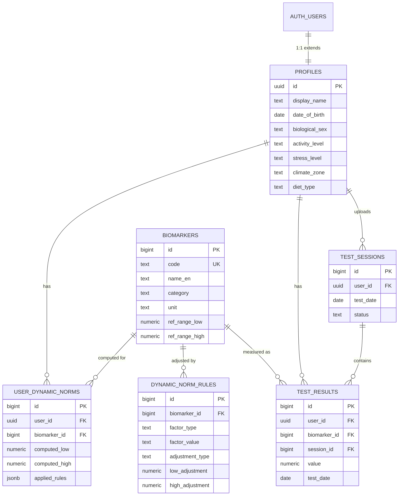
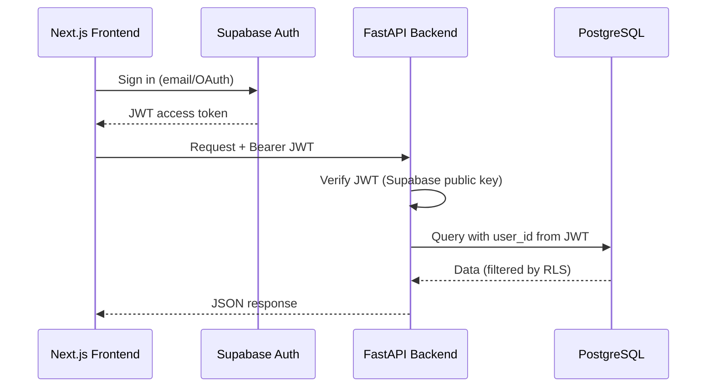
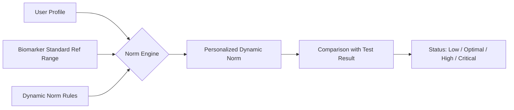

# VITOGRAPH — Architecture: Database Schema & API Structure

> **Последнее обновление:** 17 апреля 2026
>
> Смотрите также: [API Reference](./api_reference.md) | [Frontend Components](./frontend_components.md) | [AI Pipeline](./ai_pipeline.md)

> **Slogan:** "Feed your cells, find balance."
>
> **Purpose:** Health-tech AI platform that calculates a **Dynamic Norm** for vitamins and minerals
> based on user lifestyle, environment, and blood test data.

---

## 1. Tech Stack Overview

| Layer      | Technology                                     |
| ---------- | ---------------------------------------------- |
| Frontend   | Next.js (App Router, Server Components)        |
| AI/App API | Node.js / Express (Port 3001) - *Hybrid Layer* |
| Core API   | Python 3.12+, FastAPI (async-first)            |
| Database   | Supabase (PostgreSQL 15+, pgvector, RLS)       |
| Auth       | Supabase Auth (JWT, RLS integration)           |
| Storage    | Supabase Storage (blood test PDFs / images)    |
| AI/ML      | pgvector for embeddings, external LLM services |
| LLM        | `gpt-5.4-mini-2026-03-17` (assistant + diary), `gpt-4o` (vision/lab analyzers) |

---

## 2. Database Schema (PostgreSQL / Supabase)

### 2.1 Design Principles (from Supabase Best Practices)

- **Primary Keys:** `bigint generated always as identity` for internal tables; `uuid` (v7 when available) for user-facing/distributed IDs.
- **Text fields:** `text` instead of `varchar(n)` — same performance, no artificial limits.
- **Timestamps:** Always `timestamptz`, never bare `timestamp`.
- **Money / numeric values:** `numeric(p,s)`, never `float`.
- **Foreign keys:** Always create an explicit index on FK columns.
- **Enums:** Use `text` + `check` constraint or a dedicated lookup table (easier to extend).
- **Identifiers:** Always lowercase (`snake_case`).
- **Row-Level Security (RLS):** Enabled on all user-facing tables; policies tied to `auth.uid()`.

### 2.2 Core Tables

#### 2.2.1 `profiles` — Extended User Profile

> Extends `auth.users` via a 1-to-1 relationship. Stores lifestyle and environment factors needed for Dynamic Norm calculation.

| Column              | Type           | Constraints / Notes                                                                                                                                                             |
| ------------------- | -------------- | ------------------------------------------------------------------------------------------------------------------------------------------------------------------------------- |
| `id`                | `uuid`         | PK, references `auth.users(id)` on delete cascade                                                                                                                               |
| `display_name`      | `text`         | Nullable                                                                                                                                                                        |
| `date_of_birth`     | `date`         | Nullable, for age-based norm adjustments                                                                                                                                        |
| `biological_sex`    | `text`         | Check: `male`, `female`, `other`. Required for reference ranges                                                                                                                 |
| `height_cm`         | `numeric(5,1)` | Nullable                                                                                                                                                                        |
| `weight_kg`         | `numeric(5,1)` | Nullable                                                                                                                                                                        |
| `lifestyle_markers` | `jsonb`        | **CRITICAL:** Stores the remaining 40+ onboarding markers defined in [`docs/core_markers_50.md`](./core_markers_50.md). This object is updated dynamically by the LangGraph AI. |
| `city`              | `text`         | Nullable, for geo-environmental factors                                                                                                                                         |
| `timezone`          | `text`         | IANA timezone, e.g. `Asia/Singapore`                                                                                                                                            |
| `created_at`        | `timestamptz`  | Default `now()`                                                                                                                                                                 |
| `updated_at`        | `timestamptz`  | Default `now()`, updated by trigger                                                                                                                                             |

> **RLS Policy:** User can only read/write their own profile (`auth.uid() = id`).

---

#### 2.2.2 `biomarkers` — Dictionary of Blood Markers

> Reference table containing the master list of all biomarkers the platform supports, with their standard reference ranges.

| Column               | Type              | Constraints / Notes                                                |
| -------------------- | ----------------- | ------------------------------------------------------------------ |
| `id`                 | `bigint identity` | PK                                                                 |
| `code`               | `text`            | Unique, machine-readable code, e.g. `VIT_D_25OH`, `FERRITIN`       |
| `name_en`            | `text`            | English display name                                               |
| `name_ru`            | `text`            | Russian display name (nullable)                                    |
| `category`           | `text`            | Check: `vitamin`, `mineral`, `hormone`, `enzyme`, `lipid`, `other` |
| `unit`               | `text`            | Measurement unit, e.g. `ng/mL`, `µmol/L`, `pg/mL`                  |
| `ref_range_low`      | `numeric(10,3)`   | Standard lower bound of reference range                            |
| `ref_range_high`     | `numeric(10,3)`   | Standard upper bound of reference range                            |
| `optimal_range_low`  | `numeric(10,3)`   | Optimal (functional) lower bound (nullable)                        |
| `optimal_range_high` | `numeric(10,3)`   | Optimal (functional) upper bound (nullable)                        |
| `description`        | `text`            | Short description of what this marker indicates                    |
| `aliases`            | `jsonb`           | Alternate names, e.g. `["25-hydroxyvitamin D", "Calcidiol"]`       |
| `is_active`          | `boolean`         | Default `true`, soft-delete flag                                   |
| `created_at`         | `timestamptz`     | Default `now()`                                                    |
| `updated_at`         | `timestamptz`     | Default `now()`                                                    |

> **RLS Policy:** Read-only for all authenticated users. Write restricted to `service_role`.
>
> **Indexes:** Unique index on `code`. Index on `category`.

---

#### 2.2.3 `test_results` — User's Blood Test Values

> Stores individual biomarker values from a user's blood test upload.

| Column             | Type              | Constraints / Notes                                                     |
| ------------------ | ----------------- | ----------------------------------------------------------------------- |
| `id`               | `bigint identity` | PK                                                                      |
| `user_id`          | `uuid`            | FK → `profiles(id)` on delete cascade. **Indexed.**                     |
| `biomarker_id`     | `bigint`          | FK → `biomarkers(id)`. **Indexed.**                                     |
| `value`            | `numeric(10,3)`   | The measured value                                                      |
| `unit`             | `text`            | Unit as reported on the test (may differ from biomarker canonical unit) |
| `test_date`        | `date`            | When the blood test was taken                                           |
| `lab_name`         | `text`            | Nullable, lab that performed the test                                   |
| `source`           | `text`            | Check: `manual`, `ocr_upload`, `api_integration`                        |
| `source_file_path` | `text`            | Nullable, Supabase Storage path to uploaded PDF/image                   |
| `notes`            | `text`            | Nullable, user notes                                                    |
| `created_at`       | `timestamptz`     | Default `now()`                                                         |

> **RLS Policy:** User can only CRUD their own test results (`auth.uid() = user_id`).
>
> **Indexes:**
> - `test_results_user_id_idx` on `(user_id)`
> - `test_results_biomarker_id_idx` on `(biomarker_id)`
> - `test_results_user_date_idx` on `(user_id, test_date desc)` — for fast timeline queries

---

#### 2.2.4 `test_sessions` — Grouping Test Results by Upload

> Groups multiple `test_results` from the same blood test into a single session.

| Column             | Type              | Constraints / Notes                                  |
| ------------------ | ----------------- | ---------------------------------------------------- |
| `id`               | `bigint identity` | PK                                                   |
| `user_id`          | `uuid`            | FK → `profiles(id)` on delete cascade. **Indexed.**  |
| `test_date`        | `date`            | Date when the blood test was taken                   |
| `lab_name`         | `text`            | Nullable                                             |
| `source_file_path` | `text`            | Nullable, Supabase Storage path                      |
| `status`           | `text`            | Check: `pending`, `processing`, `completed`, `error` |
| `notes`            | `text`            | Nullable                                             |
| `created_at`       | `timestamptz`     | Default `now()`                                      |

> **Relation:** `test_results` should also have a `session_id` FK → `test_sessions(id)` (nullable for backward compatibility).
>
> **RLS Policy:** User can only access their own sessions.

---

#### 2.2.5 `dynamic_norm_rules` — Rules for Shifting Reference Ranges

> Stores the rules that define how lifestyle/environment factors shift the standard reference range.
> These rules are the **core intellectual property** of the platform's Dynamic Norm engine.

| Column             | Type              | Constraints / Notes                                                                                               |
| ------------------ | ----------------- | ----------------------------------------------------------------------------------------------------------------- |
| `id`               | `bigint identity` | PK                                                                                                                |
| `biomarker_id`     | `bigint`          | FK → `biomarkers(id)`. **Indexed.**                                                                               |
| `factor_type`      | `text`            | The profile field this rule applies to, e.g. `activity_level`, `climate_zone`, `stress_level`, `pregnancy_status` |
| `factor_value`     | `text`            | The specific value of the factor, e.g. `very_active`, `tropical`, `pregnant`                                      |
| `adjustment_type`  | `text`            | Check: `absolute`, `percentage`, `override`                                                                       |
| `low_adjustment`   | `numeric(10,3)`   | Shift applied to `ref_range_low` (positive = increase, negative = decrease)                                       |
| `high_adjustment`  | `numeric(10,3)`   | Shift applied to `ref_range_high`                                                                                 |
| `priority`         | `integer`         | Default `0`. Higher priority rules override lower when conflicts arise                                            |
| `rationale`        | `text`            | Scientific rationale / reference for this rule                                                                    |
| `source_reference` | `text`            | Nullable, link to study / guideline                                                                               |
| `is_active`        | `boolean`         | Default `true`                                                                                                    |
| `created_at`       | `timestamptz`     | Default `now()`                                                                                                   |
| `updated_at`       | `timestamptz`     | Default `now()`                                                                                                   |

> **RLS Policy:** Read-only for authenticated users. Write restricted to `service_role`.
>
> **Indexes:**
> - `dynamic_norm_rules_biomarker_id_idx` on `(biomarker_id)`
> - `dynamic_norm_rules_factor_idx` on `(biomarker_id, factor_type, factor_value)` — composite, for fast rule lookup

---

#### 2.2.6 `user_dynamic_norms` — Computed Personal Ranges (Cache)

> Caches the computed Dynamic Norm per user per biomarker. Recalculated when profile or rules change.

| Column          | Type              | Constraints / Notes                                       |
| --------------- | ----------------- | --------------------------------------------------------- |
| `id`            | `bigint identity` | PK                                                        |
| `user_id`       | `uuid`            | FK → `profiles(id)` on delete cascade. **Indexed.**       |
| `biomarker_id`  | `bigint`          | FK → `biomarkers(id)`. **Indexed.**                       |
| `computed_low`  | `numeric(10,3)`   | Personalized lower bound                                  |
| `computed_high` | `numeric(10,3)`   | Personalized upper bound                                  |
| `applied_rules` | `jsonb`           | Array of rule IDs and adjustments that produced this norm |
| `computed_at`   | `timestamptz`     | When the norm was last computed                           |

> **RLS Policy:** User can only read their own norms.
>
> **Unique constraint:** `(user_id, biomarker_id)` — one norm per user per biomarker.

### 2.3 Food Diary & Nutrition Tracking

#### 2.3.1 `food_items` — Master Database of Foods and Macros

> Stores nutritional information for various food items per 100g. 

| Column          | Type              | Constraints / Notes                                                              |
| --------------- | ----------------- | -------------------------------------------------------------------------------- |
| `id`            | `bigint identity` | PK                                                                               |
| `name`          | `text`            | Name of the food item (e.g., "Овсянка", "Яблоко")                                |
| `glycemic_index`| `int`             | Glycemic Index (0-100), PRIMARY METRIC for Insulin Surfing                       |
| `glycemic_load` | `numeric(6,1)`    | Computed Glycemic Load                                                           |
| `calories`      | `numeric(6,2)`    | (Legacy/Computational context) Calories per 100g                                 |
| `proteins`      | `numeric(6,2)`    | (Legacy/Computational context) Proteins (g) per 100g                             |
| `fats`          | `numeric(6,2)`    | (Legacy/Computational context) Fats (g) per 100g                                 |
| `carbs`         | `numeric(6,2)`    | (Legacy/Computational context) Carbohydrates (g) per 100g                        |
| `fiber`         | `numeric(6,2)`    | Fiber (g) per 100g, crucial for GI buffering math                                |
| `micros`        | `jsonb`           | Object containing vitamins/minerals per 100g (e.g., `{"iron": 1.2, "calc": 50}`) |
| `is_verified`   | `boolean`         | Default `false` (until verified by admin/nutrition DB)                           |
| `created_at`    | `timestamptz`     | Default `now()`                                                                  |

> **Indexes:** Trigram index on `name` for fast text search.

---

#### 2.3.2 `daily_food_logs` — User's Food Consumption History

> Records individual meals/items logged by the user, linked to specific dates and times.

| Column              | Type              | Constraints / Notes                                     |
| ------------------- | ----------------- | ------------------------------------------------------- |
| `id`                | `bigint identity` | PK                                                      |
| `user_id`           | `uuid`            | FK → `profiles(id)` on delete cascade. **Indexed.**     |
| `food_item_id`      | `bigint`          | FK → `food_items(id)`. Nullable (if custom text entry). |
| `raw_text`          | `text`            | Original text/audio input (e.g., "съела 200г овсянки")  |
| `weight_g`          | `numeric(6,1)`    | Weight in grams                                         |
| `glycemic_response` | `jsonb`           | AI computed glycemic reaction (zone, baseline_shift)    |
| `calories_computed` | `numeric(6,1)`    | (Hidden context) Total calories calculated              |
| `macros_computed`   | `jsonb`           | (Hidden context) Total macros calculated                |
| `micros_computed`   | `jsonb`           | Total micros calculated based on weight                 |
| `logged_at`         | `timestamptz`     | When the food was eaten                                 |
| `created_at`        | `timestamptz`     | Default `now()`                                         |

> **RLS Policy:** User can only CRUD their own food logs (`auth.uid() = user_id`).
>
> **Indexes:** Index on `(user_id, logged_at desc)` for fast daily summaries.

---

### 2.4 Дополнительные таблицы

| Table | Purpose |
|---|---|
| `meal_logs` | Food diary entries with `micronutrients` JSONB |
| `meal_items` | Individual food items within a meal |
| `supplement_logs` | BAD intake tracking with `taken_at`, `was_on_time` |
| `ai_chat_messages` | Chat history persistence (user/assistant messages) |
| `feedback` | User feedback with anti-spam (`created_at` cooldown) |
| `active_condition_knowledge_bases` | Medical condition knowledge for norm adjustments |
| `lab_scans` | Async OCR job tracking: `PENDING → PROCESSING → COMPLETED/FAILED` |
| `user_memory_vectors` | Семантическая память: факты, предпочтения, действия ассистента. pgvector embedding (384d, HNSW). См. [memory_architecture.md](./memory_architecture.md) |
| `user_emotional_profile` | Эмпатическая память: настроение, тренд, уровень доверия. Обновляется асинхронно через Edge Function |
| `memory_consolidation_log` | Лог ежедневной консолидации (pending → success/failed) |
| `user_active_skills` | Health goal journeys: FSM lifecycle, step plan, skill document + embedding для контекстного роутинга |
| `_app_config` | Internal config: edge_function_url, service_role_key для pg_net trigger'ов |
| `biomarker_note_cache` | Семантический кэш AI-описаний биомаркеров (slug + flag → description) |

> `profiles` extended with: `lab_diagnostic_reports` (JSONB), `active_supplement_protocol` (JSONB), `active_nutrition_targets` (JSONB), `active_condition_knowledge_bases` FK

#### `lab_scans` schema

| Column       | Type          | Notes                                                            |
| ------------ | ------------- | ---------------------------------------------------------------- |
| `id`         | `uuid`        | PK, `gen_random_uuid()`                                          |
| `user_id`    | `uuid`        | FK → `profiles(id)` ON DELETE CASCADE. **Indexed.**              |
| `status`     | `text`        | CHECK: `PENDING`, `PROCESSING`, `COMPLETED`, `FAILED`            |
| `file_count` | `integer`     | Количество файлов в batch                                        |
| `result`     | `jsonb`       | `LabReportExtraction` (заполняется при COMPLETED)                |
| `error`      | `text`        | Сообщение об ошибке (заполняется при FAILED, nullable)           |
| `created_at` | `timestamptz` | Default `now()`                                                  |
| `updated_at` | `timestamptz` | Автообновляется тригером `trg_lab_scans_updated_at`              |

> **RLS Policy:** `SELECT` — только своя строка (`auth.uid() = user_id`). `INSERT/UPDATE` — только своя строка.
> **Realtime:** Таблица добавлена в `supabase_realtime` publication → фронтенд получает `postgres_changes` события.

### 2.5 Future Tables

| Table                  | Purpose                                                                                    |
| ---------------------- | ------------------------------------------------------------------------------------------ |
| `biomarker_embeddings` | pgvector `vector(1536)` column for semantic search over biomarker descriptions and aliases |
| `ai_recommendations`   | AI-generated personalized supplement / food recommendations                                |
| `notifications`        | Alerts for re-testing, new recommendations, etc.                                           |

---

### 2.6 Entity-Relationship Diagram (Expanded)



---

## 3. Backend Structure (Actual — Phase 53f)

### 3.1 Node.js AI API (`apps/api/src/ai`)
- **Role:** AI Orchestration, Chat, Food Vision, Lab Diagnostics, Somatic Analysis, Nutrition Targets.
- **Stack:** Express, LangGraph, Vercel AI SDK, Zod.
- **Port:** `3001`.
- **Entry:** `server.ts` → `ai.routes.ts`, `supplement.routes.ts`, `integration.ts`.

### 3.2 Python Core API (`apps/api`)
- **Role:** Profile management, PDF/Image parsing, Dynamic Norms, Analytics, Feedback.
- **Stack:** FastAPI, AsyncOpenAI, Pydantic V2, Supabase Python SDK.
- **Port:** `8001`.
- **Entry:** `main.py`.

### 3.3 Actual Directory Layout

```
apps/api/
├── main.py                     # FastAPI entry point (lifespan, CORS, routers)
├── core/
│   ├── config.py               # Pydantic Settings (env vars)
│   ├── database.py             # Supabase AsyncClient manager
│   └── exceptions.py           # Custom exceptions
├── api/v1/endpoints/           # REST Routers
│   ├── profiles.py             # GET/POST/PATCH /api/v1/profiles
│   ├── norms.py                # POST /api/v1/norms/{user_id}/calculate
│   ├── test_results.py         # POST /api/v1/test-results, upload-pdf
│   ├── analysis.py             # GET /api/v1/analysis sessions
│   ├── analytics.py            # GET micronutrient-trends, lab-schedule
│   └── users.py                # POST /api/v1/users/me/feedback
├── schemas/                    # Pydantic V2 schemas (8 files)
├── repositories/               # Data access (profile, test_result repos)
├── services/                   # Business logic
│   ├── norm_engine.py          # Dynamic Norm calculation
│   ├── dynamic_norm_service.py # Full norm recalculation engine
│   ├── analysis_service.py     # Session vs. norms comparison
│   ├── file_parser.py          # AI-powered biomarker extraction
│   ├── pdf_parser.py           # PyPDF text extraction
│   ├── pdf_service.py          # PDF → LLM → structured biomarkers
│   └── lab_report_storage.py   # Report persistence
└── src/ai/                     # Node.js AI Engine
    └── src/
        ├── server.ts            # Express server
        ├── ai.controller.ts     # Main controller, context formatters
        ├── ai-schemas.ts        # Zod output schemas
        ├── llm-client.ts        # callLlmStructured wrapper
        ├── request-schemas.ts   # Zod input validation
        ├── services/
        │   ├── memory.service.ts   # L2+L3 memory fetch, embedding singleton
        │   ├── skills.service.ts   # fetchActiveSkills, fetchMatchingSkillDocument
        │   └── kb.service.ts       # Hybrid KB search (semantic + lexical, RRF)
        ├── prompts/
        │   └── chat-prompt-builder.ts # Centralized prompt builder
        ├── graph/               # LangGraph ReAct Agent
        │   ├── builder.ts       # Graph definition + dedup interceptor + sanitizeMessages()
        │   ├── state.ts         # GraphAnnotation (messages + medicalContext)
        │   ├── tools.ts         # 7 tools (log_meal, log_supplement, manage_health_goals, log_assistant_action, ...)
        │   ├── checkpointer.ts  # PostgresSaver (persistent memory L1)
        │   ├── food-vision-analyzer.ts
        │   ├── lab-report-analyzer.ts
        │   ├── label-scanner.ts  # Анализ этикеток / состава (E-коды, вердикт)
        │   ├── nutrition-analyzer.ts
        │   └── vision-analyzer.ts
        ├── supplement/          # Supplement tracking
        └── routes/              # Express routers
```

### 3.4 Key API Endpoints (Actual)

> For full reference with request/response schemas, see [API Reference](./api_reference.md).

**Node.js AI Engine (port 3001):**

| Method   | Endpoint                                    | Description                                     |
| -------- | ------------------------------------------- | ----------------------------------------------- |
| `POST`   | `/api/v1/ai/chat`                           | AI chat (LangGraph, diary/assistant modes)      |
| `POST`   | `/api/v1/ai/chat/stream`                    | AI chat SSE streaming (typewriter UI)           |
| `GET`    | `/api/v1/ai/chat/history`                   | Chat history                                    |
| `POST`   | `/api/v1/ai/analyze`                        | Symptom-food correlation analysis               |
| `POST`   | `/api/v1/ai/diagnose`                       | Diagnostic hypothesis generation                |
| `POST`   | `/api/v1/ai/analyze-somatic`                | Nail/tongue/skin photo analysis (GPT-4o Vision) |
| `POST`   | `/api/v1/ai/analyze-food`                   | Food photo recognition (GPT-Vision)             |
| `POST`   | `/api/v1/ai/vision/label`                   | Food label / ingredient analysis (E-коды, вердикт) |
| `POST`   | `/api/v1/ai/analyze-lab-report`             | Premium blood test diagnostics                  |
| `GET`    | `/api/v1/ai/lab-reports/history`            | Lab report history                              |
| `DELETE` | `/api/v1/ai/lab-reports/history/:timestamp` | Delete a lab report                             |
| `GET`    | `/api/v1/ai/somatic-history`                | Somatic analysis history                        |
| `GET`    | `/api/v1/ai/nutrition-targets`              | Deterministic nutrition norms                   |
| `GET`    | `/api/v1/ai/diary-macros`                   | Aggregated macros for a specific day            |
| `PATCH`  | `/api/v1/ai/meal-log/:id`                   | Update meal log entry                           |
| `DELETE` | `/api/v1/ai/meal-log/:id`                   | Delete meal log entry                           |
| `POST`   | `/api/v1/ai/analytics/correlate-symptoms`   | Symptom-food correlation analytics              |
| `DELETE` | `/api/v1/ai/users/me`                       | Delete user account                             |
| `DELETE` | `/api/v1/ai/chat/history`                   | Clear chat history                              |
| `GET`    | `/api/v1/supplements/today`                 | Today's supplement protocol + logs              |
| `POST`   | `/api/v1/supplements/log`                   | Log supplement intake                           |
| `DELETE` | `/api/v1/supplements/log/:id`               | Delete supplement log entry                     |
| `POST`   | `/api/v1/integration/parse`                 | Parse PDF lab report + save to DB               |
| `POST`   | `/api/v1/integration/parse-image`           | Parse lab report photo + save to DB (sync)      |
| `POST`   | `/api/v1/integration/parse-image-batch`     | Parse batch photos, sync fallback (up to 10)    |
| `POST`   | `/api/v1/integration/parse-image-batch-async` | Initiate async batch OCR → returns `job_id`   |
| `GET`    | `/api/v1/integration/lab-scans/:jobId`      | Poll async OCR job status                       |
| `POST`   | `/api/v1/integration/norms`                 | Calculate norms via Python Engine               |

**Python Core API (port 8001):**

| Method  | Endpoint                                           | Description                             |
| ------- | -------------------------------------------------- | --------------------------------------- |
| `POST`  | `/parse`                                           | Extract biomarkers from PDF/DOCX/TXT                          |
| `POST`  | `/parse-image`                                     | OCR lab report photo (GPT-4o Vision)                          |
| `POST`  | `/parse-image-batch`                               | Parse batch photos, sync fallback (up to 10)                  |
| `POST`  | `/parse-image-batch-async` 🆕                      | Async batch OCR → creates `lab_scans` job, returns `job_id`   |
| `GET`   | `/lab-scans/{job_id}` 🆕                           | Get async OCR job status (polling fallback)                    |
| `POST`  | `/refresh-notes`                                   | Recalculate flags & generate AI clinical notes                |
| `POST`  | `/calculate`                                       | Dynamic Norm calculation (MVP)          |
| `GET`   | `/api/v1/profiles/{user_id}`                       | Get user profile                        |
| `POST`  | `/api/v1/profiles`                                 | Create profile (onboarding)             |
| `PATCH` | `/api/v1/profiles/{user_id}`                       | Update profile (invalidates norm cache) |
| `POST`  | `/api/v1/norms/{user_id}/calculate`                | Full dynamic norm recalculation         |
| `POST`  | `/api/v1/test-results/{user_id}`                   | Upload blood test session               |
| `POST`  | `/api/v1/test-results/{user_id}/upload-pdf`        | Upload PDF → LLM extraction → preview   |
| `GET`   | `/api/v1/analysis/{user_id}/sessions/{id}`         | Compare session vs. dynamic norms       |
| `GET`   | `/api/v1/analytics/{user_id}/micronutrient-trends` | Micronutrient trends (N days)           |
| `GET`   | `/api/v1/analytics/{user_id}/lab-schedule`         | Predictive lab testing schedule         |
| `POST`  | `/api/v1/users/me/feedback`                        | Submit feedback (60s rate limit)        |

---

## 4. Authentication & Authorization Flow



- **Supabase Auth** handles all authentication (sign up, login, OAuth, magic links).
- **FastAPI** verifies the JWT and extracts `user_id` from the token claims.
- **RLS** enforces row-level data isolation in PostgreSQL — defense-in-depth.

---

## 5. Dynamic Norm Calculation Engine (Conceptual)



### Algorithm Overview

1. Fetch the biomarker's standard `ref_range_low` and `ref_range_high`.
2. Query `dynamic_norm_rules` for all rules matching the user's profile factors.
3. Apply adjustments in order of `priority` (higher priority last):
   - `absolute`: add/subtract fixed amount.
   - `percentage`: shift by percentage of the original range.
   - `override`: replace the range entirely.
4. Clamp final range to physiologically valid bounds.
5. Store result in `user_dynamic_norms` cache table.
6. Compare user's `test_results.value` against personalized range.

---

## 6. pgvector Integration

> **Extension:** `CREATE EXTENSION vector;`

Активно используется в production:

- **Семантическая память:** `user_memory_vectors.embedding vector(384)` — HNSW index, `text-embedding-3-small` (OpenAI). Поиск через RPC `match_user_memories()` (threshold=0.25).
- **Skill Documents:** `user_active_skills.skill_embedding vector(384)` — `gte-small` (Supabase.ai). Контекстный роутинг через `match-skill-context` Edge Function.
- **Knowledge Base:** `kb_chunks.embedding vector(384)` — hybrid search (semantic + lexical) через RPC `hybrid_search_kb()` (RRF fusion).
- **Biomarker Semantic Cache:** `biomarker_note_cache` — slug+flag lookup, ускоряет генерацию lab report на 1000–2000 токенов.

---

## 7. Key Design Decisions & Rationale

| Decision                              | Rationale                                                                       |
| ------------------------------------- | ------------------------------------------------------------------------------- |
| `profiles` separate from `auth.users` | Supabase Auth owns the users table; we extend it with a 1:1 `profiles` table    |
| `bigint identity` for most PKs        | Postgres best practice: sequential, compact, no fragmentation (per skill rules) |
| `uuid` for `profiles.id`              | Must match `auth.users.id` which is UUID                                        |
| `jsonb` for `chronic_conditions`      | Flexible schema for variable-length lists; queryable with GIN indexes           |
| Cache table `user_dynamic_norms`      | Avoid recomputing norms on every request; invalidate on profile or rule changes |
| `test_sessions` grouping              | Allows batch upload and associating all results from one blood draw             |
| Repository pattern in API             | Abstracts DB access for testability and clean architecture (SOLID)              |
| API versioning (`/v1/`)               | Future-proof: breaking changes go to `/v2/` without disrupting existing clients |
| `factor_type` + `factor_value`        | Generic key-value approach for rules: extensible without schema changes         |
