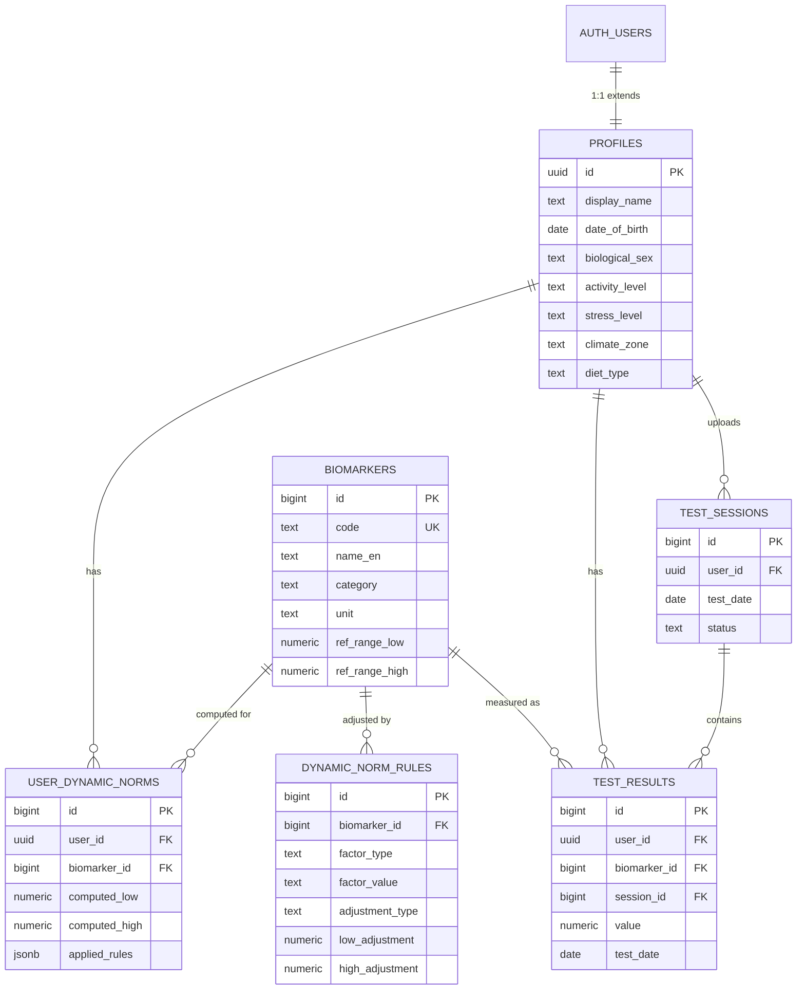
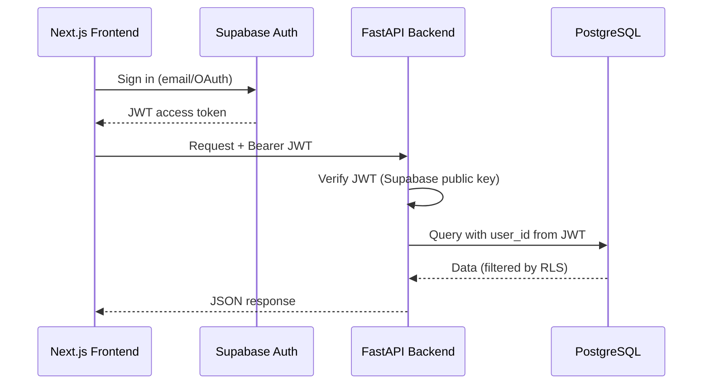
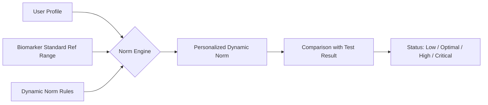

# VITOGRAPH — Architecture: Database Schema & API Structure

> **Slogan:** "Feed your cells, find balance."
>
> **Purpose:** Health-tech AI platform that calculates a **Dynamic Norm** for vitamins and minerals
> based on user lifestyle, environment, and blood test data.

---

## 1. Tech Stack Overview

| Layer       | Technology                                     |
|-------------|------------------------------------------------|
| Frontend    | Next.js (App Router, Server Components)        |
| AI/App API  | Node.js / Express (Port 3001) - *Hybrid Layer* |
| Core API    | Python 3.12+, FastAPI (async-first)            |
| Database    | Supabase (PostgreSQL 15+, pgvector, RLS)       |
| Auth        | Supabase Auth (JWT, RLS integration)           |
| Storage     | Supabase Storage (blood test PDFs / images)    |
| AI/ML       | pgvector for embeddings, external LLM services |

---

## 2. Database Schema (PostgreSQL / Supabase)

### 2.1 Design Principles (from Supabase Best Practices)

- **Primary Keys:** `bigint generated always as identity` for internal tables; `uuid` (v7 when available) for user-facing/distributed IDs.
- **Text fields:** `text` instead of `varchar(n)` — same performance, no artificial limits.
- **Timestamps:** Always `timestamptz`, never bare `timestamp`.
- **Money / numeric values:** `numeric(p,s)`, never `float`.
- **Foreign keys:** Always create an explicit index on FK columns.
- **Enums:** Use `text` + `check` constraint or a dedicated lookup table (easier to extend).
- **Identifiers:** Always lowercase (`snake_case`).
- **Row-Level Security (RLS):** Enabled on all user-facing tables; policies tied to `auth.uid()`.

### 2.2 Core Tables

#### 2.2.1 `profiles` — Extended User Profile

> Extends `auth.users` via a 1-to-1 relationship. Stores lifestyle and environment factors needed for Dynamic Norm calculation.

| Column               | Type                  | Constraints / Notes                                                        |
|----------------------|-----------------------|----------------------------------------------------------------------------|
| `id`                 | `uuid`                | PK, references `auth.users(id)` on delete cascade                         |
| `display_name`       | `text`                | Nullable                                                                   |
| `date_of_birth`      | `date`                | Nullable, for age-based norm adjustments                                   |
| `biological_sex`     | `text`                | Check: `male`, `female`, `other`. Required for reference ranges            |
| `height_cm`          | `numeric(5,1)`        | Nullable                                                                   |
| `weight_kg`          | `numeric(5,1)`        | Nullable                                                                   |
| `lifestyle_markers`  | `jsonb`               | **CRITICAL:** Stores the remaining 40+ onboarding markers defined in [`docs/core_markers_50.md`](./core_markers_50.md). This object is updated dynamically by the LangGraph AI. |
| `city`               | `text`                | Nullable, for geo-environmental factors                                    |
| `timezone`           | `text`                | IANA timezone, e.g. `Asia/Singapore`                                       |
| `created_at`         | `timestamptz`         | Default `now()`                                                            |
| `updated_at`         | `timestamptz`         | Default `now()`, updated by trigger                                        |

> **RLS Policy:** User can only read/write their own profile (`auth.uid() = id`).

---

#### 2.2.2 `biomarkers` — Dictionary of Blood Markers

> Reference table containing the master list of all biomarkers the platform supports, with their standard reference ranges.

| Column                  | Type                  | Constraints / Notes                                                  |
|-------------------------|-----------------------|----------------------------------------------------------------------|
| `id`                    | `bigint identity`     | PK                                                                   |
| `code`                  | `text`                | Unique, machine-readable code, e.g. `VIT_D_25OH`, `FERRITIN`        |
| `name_en`               | `text`                | English display name                                                 |
| `name_ru`               | `text`                | Russian display name (nullable)                                      |
| `category`              | `text`                | Check: `vitamin`, `mineral`, `hormone`, `enzyme`, `lipid`, `other`   |
| `unit`                  | `text`                | Measurement unit, e.g. `ng/mL`, `µmol/L`, `pg/mL`                   |
| `ref_range_low`         | `numeric(10,3)`       | Standard lower bound of reference range                              |
| `ref_range_high`        | `numeric(10,3)`       | Standard upper bound of reference range                              |
| `optimal_range_low`     | `numeric(10,3)`       | Optimal (functional) lower bound (nullable)                          |
| `optimal_range_high`    | `numeric(10,3)`       | Optimal (functional) upper bound (nullable)                          |
| `description`           | `text`                | Short description of what this marker indicates                      |
| `aliases`               | `jsonb`               | Alternate names, e.g. `["25-hydroxyvitamin D", "Calcidiol"]`        |
| `is_active`             | `boolean`             | Default `true`, soft-delete flag                                     |
| `created_at`            | `timestamptz`         | Default `now()`                                                      |
| `updated_at`            | `timestamptz`         | Default `now()`                                                      |

> **RLS Policy:** Read-only for all authenticated users. Write restricted to `service_role`.
>
> **Indexes:** Unique index on `code`. Index on `category`.

---

#### 2.2.3 `test_results` — User's Blood Test Values

> Stores individual biomarker values from a user's blood test upload.

| Column              | Type                  | Constraints / Notes                                                    |
|---------------------|-----------------------|------------------------------------------------------------------------|
| `id`                | `bigint identity`     | PK                                                                     |
| `user_id`           | `uuid`                | FK → `profiles(id)` on delete cascade. **Indexed.**                    |
| `biomarker_id`      | `bigint`              | FK → `biomarkers(id)`. **Indexed.**                                    |
| `value`             | `numeric(10,3)`       | The measured value                                                     |
| `unit`              | `text`                | Unit as reported on the test (may differ from biomarker canonical unit)|
| `test_date`         | `date`                | When the blood test was taken                                          |
| `lab_name`          | `text`                | Nullable, lab that performed the test                                  |
| `source`            | `text`                | Check: `manual`, `ocr_upload`, `api_integration`                       |
| `source_file_path`  | `text`                | Nullable, Supabase Storage path to uploaded PDF/image                  |
| `notes`             | `text`                | Nullable, user notes                                                   |
| `created_at`        | `timestamptz`         | Default `now()`                                                        |

> **RLS Policy:** User can only CRUD their own test results (`auth.uid() = user_id`).
>
> **Indexes:**
> - `test_results_user_id_idx` on `(user_id)`
> - `test_results_biomarker_id_idx` on `(biomarker_id)`
> - `test_results_user_date_idx` on `(user_id, test_date desc)` — for fast timeline queries

---

#### 2.2.4 `test_sessions` — Grouping Test Results by Upload

> Groups multiple `test_results` from the same blood test into a single session.

| Column              | Type                  | Constraints / Notes                                            |
|---------------------|-----------------------|----------------------------------------------------------------|
| `id`                | `bigint identity`     | PK                                                             |
| `user_id`           | `uuid`                | FK → `profiles(id)` on delete cascade. **Indexed.**            |
| `test_date`         | `date`                | Date when the blood test was taken                             |
| `lab_name`          | `text`                | Nullable                                                       |
| `source_file_path`  | `text`                | Nullable, Supabase Storage path                                |
| `status`            | `text`                | Check: `pending`, `processing`, `completed`, `error`           |
| `notes`             | `text`                | Nullable                                                       |
| `created_at`        | `timestamptz`         | Default `now()`                                                |

> **Relation:** `test_results` should also have a `session_id` FK → `test_sessions(id)` (nullable for backward compatibility).
>
> **RLS Policy:** User can only access their own sessions.

---

#### 2.2.5 `dynamic_norm_rules` — Rules for Shifting Reference Ranges

> Stores the rules that define how lifestyle/environment factors shift the standard reference range.
> These rules are the **core intellectual property** of the platform's Dynamic Norm engine.

| Column              | Type                  | Constraints / Notes                                                       |
|---------------------|-----------------------|---------------------------------------------------------------------------|
| `id`                | `bigint identity`     | PK                                                                        |
| `biomarker_id`      | `bigint`              | FK → `biomarkers(id)`. **Indexed.**                                       |
| `factor_type`       | `text`                | The profile field this rule applies to, e.g. `activity_level`, `climate_zone`, `stress_level`, `pregnancy_status` |
| `factor_value`      | `text`                | The specific value of the factor, e.g. `very_active`, `tropical`, `pregnant` |
| `adjustment_type`   | `text`                | Check: `absolute`, `percentage`, `override`                               |
| `low_adjustment`    | `numeric(10,3)`       | Shift applied to `ref_range_low` (positive = increase, negative = decrease)|
| `high_adjustment`   | `numeric(10,3)`       | Shift applied to `ref_range_high`                                         |
| `priority`          | `integer`             | Default `0`. Higher priority rules override lower when conflicts arise    |
| `rationale`         | `text`                | Scientific rationale / reference for this rule                            |
| `source_reference`  | `text`                | Nullable, link to study / guideline                                       |
| `is_active`         | `boolean`             | Default `true`                                                            |
| `created_at`        | `timestamptz`         | Default `now()`                                                           |
| `updated_at`        | `timestamptz`         | Default `now()`                                                           |

> **RLS Policy:** Read-only for authenticated users. Write restricted to `service_role`.
>
> **Indexes:**
> - `dynamic_norm_rules_biomarker_id_idx` on `(biomarker_id)`
> - `dynamic_norm_rules_factor_idx` on `(biomarker_id, factor_type, factor_value)` — composite, for fast rule lookup

---

#### 2.2.6 `user_dynamic_norms` — Computed Personal Ranges (Cache)

> Caches the computed Dynamic Norm per user per biomarker. Recalculated when profile or rules change.

| Column              | Type                  | Constraints / Notes                                                     |
|---------------------|-----------------------|-------------------------------------------------------------------------|
| `id`                | `bigint identity`     | PK                                                                      |
| `user_id`           | `uuid`                | FK → `profiles(id)` on delete cascade. **Indexed.**                     |
| `biomarker_id`      | `bigint`              | FK → `biomarkers(id)`. **Indexed.**                                     |
| `computed_low`      | `numeric(10,3)`       | Personalized lower bound                                                |
| `computed_high`     | `numeric(10,3)`       | Personalized upper bound                                                |
| `applied_rules`     | `jsonb`               | Array of rule IDs and adjustments that produced this norm               |
| `computed_at`       | `timestamptz`         | When the norm was last computed                                         |

> **RLS Policy:** User can only read their own norms.
>
> **Unique constraint:** `(user_id, biomarker_id)` — one norm per user per biomarker.

### 2.3 Food Diary & Nutrition Tracking

#### 2.3.1 `food_items` — Master Database of Foods and Macros

> Stores nutritional information for various food items per 100g. 

| Column              | Type                  | Constraints / Notes                                                       |
|---------------------|-----------------------|---------------------------------------------------------------------------|
| `id`                | `bigint identity`     | PK                                                                        |
| `name`              | `text`                | Name of the food item (e.g., "Овсянка", "Яблоко")                         |
| `calories`          | `numeric(6,2)`        | Calories per 100g                                                         |
| `proteins`          | `numeric(6,2)`        | Proteins (g) per 100g                                                     |
| `fats`              | `numeric(6,2)`        | Fats (g) per 100g                                                         |
| `carbs`             | `numeric(6,2)`        | Carbohydrates (g) per 100g                                                |
| `fiber`             | `numeric(6,2)`        | Fiber (g) per 100g                                                        |
| `micros`            | `jsonb`               | Object containing vitamins/minerals per 100g (e.g., `{"iron": 1.2, "calc": 50}`) |
| `is_verified`       | `boolean`             | Default `false` (until verified by admin/nutrition DB)                    |
| `created_at`        | `timestamptz`         | Default `now()`                                                           |

> **Indexes:** Trigram index on `name` for fast text search.

---

#### 2.3.2 `daily_food_logs` — User's Food Consumption History

> Records individual meals/items logged by the user, linked to specific dates and times.

| Column              | Type                  | Constraints / Notes                                                       |
|---------------------|-----------------------|---------------------------------------------------------------------------|
| `id`                | `bigint identity`     | PK                                                                        |
| `user_id`           | `uuid`                | FK → `profiles(id)` on delete cascade. **Indexed.**                       |
| `food_item_id`      | `bigint`              | FK → `food_items(id)`. Nullable (if custom text entry).                   |
| `raw_text`          | `text`                | Original text/audio input (e.g., "съела 200г овсянки")                    |
| `weight_g`          | `numeric(6,1)`        | Weight in grams                                                           |
| `calories_computed` | `numeric(6,1)`        | Total calories calculated for this log                                    |
| `macros_computed`   | `jsonb`               | Total macros calculated `{"p": 10, "f": 5, "c": 30}`                      |
| `micros_computed`   | `jsonb`               | Total micros calculated based on weight                                   |
| `logged_at`         | `timestamptz`         | When the food was eaten                                                   |
| `created_at`        | `timestamptz`         | Default `now()`                                                           |

> **RLS Policy:** User can only CRUD their own food logs (`auth.uid() = user_id`).
>
> **Indexes:** Index on `(user_id, logged_at desc)` for fast daily summaries.

---

### 2.4 Future Tables (Post-MVP)

| Table                    | Purpose                                                       |
|--------------------------|---------------------------------------------------------------|
| `biomarker_embeddings`   | pgvector `vector(1536)` column for semantic search over biomarker descriptions and aliases |
| `ai_recommendations`    | AI-generated personalized supplement / food recommendations   |
| `food_nutrient_map`     | Mapping foods to their vitamin/mineral content                |
| `user_goals`            | User-defined health goals (e.g. "optimize energy")            |
| `notifications`         | Alerts for re-testing, new recommendations, etc.              |

---

### 2.4 Entity-Relationship Diagram (Conceptual)



---

## 3. Backend Structure (Hybrid)

### 3.1 Node.js AI API (`apps/api/src/ai`)
- **Role:** AI Orchestration, Chat, Frontend-facing logic.
- **Stack:** Express, Vercel AI SDK, Zod.
- **Port:** 3001.

### 3.2 Python Core API (`apps/api`)
- **Role:** Heavy computation, Dynamic Norms, PDF Parsing.
- **Stack:** FastAPI, Pandas, PyPDF2.
- **Port:** TBD (8000).

### 3.3 Python Design Principles (Core API)

- **Async-first:** All endpoints and DB operations use `async/await` (asyncpg).
- **Pydantic V2:** All request/response schemas use Pydantic V2 models.
- **Repository pattern:** Database access abstracted into repository classes.
- **Dependency Injection:** FastAPI's DI system for DB sessions, auth, etc.
- **Environment config:** `pydantic-settings` for configuration management.
- **Structured logging:** `structlog` or `loguru`.
- **12-factor app:** Environment-based configuration, no hardcoded secrets.

### 3.2 Proposed Directory Layout

```
apps/api/
├── pyproject.toml                  # Project metadata, dependencies (uv/pip)
├── alembic.ini                     # Alembic migration config
├── .env.example                    # Environment variable template
│
├── alembic/                        # Database migrations
│   ├── env.py
│   └── versions/
│
├── app/
│   ├── __init__.py
│   ├── main.py                     # FastAPI app factory, lifespan events
│   ├── config.py                   # Pydantic Settings (env vars)
│   │
│   ├── core/                       # Cross-cutting concerns
│   │   ├── __init__.py
│   │   ├── database.py             # Async engine, session factory
│   │   ├── security.py             # Supabase JWT verification, auth deps
│   │   ├── exceptions.py           # Custom exception classes
│   │   └── logging.py              # Structured logging setup
│   │
│   ├── models/                     # SQLAlchemy 2.0 ORM models
│   │   ├── __init__.py
│   │   ├── base.py                 # Base model with common fields
│   │   ├── profile.py              # Profile model
│   │   ├── biomarker.py            # Biomarker model
│   │   ├── test_result.py          # TestResult model
│   │   ├── test_session.py         # TestSession model
│   │   ├── dynamic_norm_rule.py    # DynamicNormRule model
│   │   └── user_dynamic_norm.py    # UserDynamicNorm model
│   │
│   ├── schemas/                    # Pydantic V2 request/response schemas
│   │   ├── __init__.py
│   │   ├── profile.py
│   │   ├── biomarker.py
│   │   ├── test_result.py
│   │   ├── test_session.py
│   │   └── dynamic_norm.py
│   │
│   ├── repositories/               # Data access layer (Repository pattern)
│   │   ├── __init__.py
│   │   ├── base.py                 # Generic async CRUD repository
│   │   ├── profile_repo.py
│   │   ├── biomarker_repo.py
│   │   ├── test_result_repo.py
│   │   └── dynamic_norm_repo.py
│   │
│   ├── services/                   # Business logic layer
│   │   ├── __init__.py
│   │   ├── profile_service.py
│   │   ├── test_upload_service.py  # OCR parsing, test result creation
│   │   ├── norm_engine.py          # Dynamic Norm calculation engine
│   │   └── ai_analysis_service.py  # LLM-based biomarker analysis
│   │
│   ├── api/                        # API routers (endpoints)
│   │   ├── __init__.py
│   │   ├── deps.py                 # Shared dependencies (get_db, get_user)
│   │   └── v1/
│   │       ├── __init__.py
│   │       ├── router.py           # Aggregated v1 router
│   │       ├── profiles.py         # /api/v1/profiles
│   │       ├── biomarkers.py       # /api/v1/biomarkers
│   │       ├── test_results.py     # /api/v1/test-results
│   │       ├── test_sessions.py    # /api/v1/test-sessions
│   │       └── dynamic_norms.py    # /api/v1/dynamic-norms
│   │
│   └── workers/                    # Background tasks / async jobs
│       ├── __init__.py
│       ├── ocr_worker.py           # Process uploaded blood test images
│       └── norm_recalculator.py    # Recalculate norms on profile change
│
└── tests/
    ├── conftest.py                 # Fixtures, test DB setup
    ├── test_profiles.py
    ├── test_biomarkers.py
    ├── test_test_results.py
    └── test_norm_engine.py
```

### 3.3 Key API Endpoints (v1)

| Method   | Endpoint                              | Description                                                |
|----------|---------------------------------------|------------------------------------------------------------|
| `GET`    | `/api/v1/profiles/me`                 | Get current user's profile                                 |
| `PUT`    | `/api/v1/profiles/me`                 | Update profile (triggers norm recalculation)               |
| `GET`    | `/api/v1/biomarkers`                  | List all supported biomarkers (paginated, filterable)      |
| `GET`    | `/api/v1/biomarkers/{code}`           | Get single biomarker details by code                       |
| `POST`   | `/api/v1/test-sessions`              | Create a new test session (with optional file upload)      |
| `GET`    | `/api/v1/test-sessions`              | List user's test sessions                                  |
| `POST`   | `/api/v1/test-results`               | Add biomarker results to a session                         |
| `GET`    | `/api/v1/test-results`               | Get user's test results (filterable by biomarker, date)    |
| `GET`    | `/api/v1/test-results/timeline/{code}` | Get historical values for a specific biomarker            |
| `GET`    | `/api/v1/dynamic-norms/me`           | Get all computed Dynamic Norms for current user            |
| `GET`    | `/api/v1/dynamic-norms/me/{code}`    | Get Dynamic Norm for a specific biomarker                  |
| `POST`   | `/api/v1/dynamic-norms/recalculate`  | Force recalculation of norms                               |
| `GET`    | `/health`                             | Health check endpoint                                      |

---

## 4. Authentication & Authorization Flow



- **Supabase Auth** handles all authentication (sign up, login, OAuth, magic links).
- **FastAPI** verifies the JWT and extracts `user_id` from the token claims.
- **RLS** enforces row-level data isolation in PostgreSQL — defense-in-depth.

---

## 5. Dynamic Norm Calculation Engine (Conceptual)



### Algorithm Overview

1. Fetch the biomarker's standard `ref_range_low` and `ref_range_high`.
2. Query `dynamic_norm_rules` for all rules matching the user's profile factors.
3. Apply adjustments in order of `priority` (higher priority last):
   - `absolute`: add/subtract fixed amount.
   - `percentage`: shift by percentage of the original range.
   - `override`: replace the range entirely.
4. Clamp final range to physiologically valid bounds.
5. Store result in `user_dynamic_norms` cache table.
6. Compare user's `test_results.value` against personalized range.

---

## 6. pgvector Integration (Future)

> **Extension:** `CREATE EXTENSION vector;`

Planned usage:

- **Biomarker semantic search:** Embed biomarker descriptions + aliases → `vector(1536)` column in `biomarker_embeddings` table. Allows fuzzy matching from OCR-extracted text to known biomarkers.
- **AI recommendations RAG:** Embed medical knowledge → retrieve relevant context for LLM-based analysis.
- **Index type:** HNSW for low-latency approximate nearest neighbor search.

---

## 7. Key Design Decisions & Rationale

| Decision                          | Rationale                                                                              |
|-----------------------------------|----------------------------------------------------------------------------------------|
| `profiles` separate from `auth.users` | Supabase Auth owns the users table; we extend it with a 1:1 `profiles` table        |
| `bigint identity` for most PKs   | Postgres best practice: sequential, compact, no fragmentation (per skill rules)        |
| `uuid` for `profiles.id`         | Must match `auth.users.id` which is UUID                                               |
| `jsonb` for `chronic_conditions` | Flexible schema for variable-length lists; queryable with GIN indexes                  |
| Cache table `user_dynamic_norms` | Avoid recomputing norms on every request; invalidate on profile or rule changes        |
| `test_sessions` grouping         | Allows batch upload and associating all results from one blood draw                    |
| Repository pattern in API        | Abstracts DB access for testability and clean architecture (SOLID)                     |
| API versioning (`/v1/`)          | Future-proof: breaking changes go to `/v2/` without disrupting existing clients        |
| `factor_type` + `factor_value`   | Generic key-value approach for rules: extensible without schema changes                |
