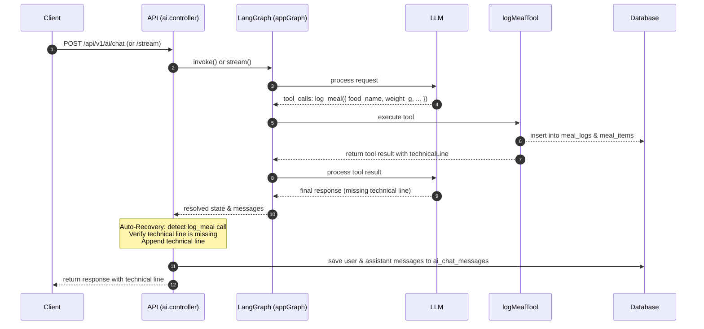

# Architecture: Food Card Technical Line Auto-Recovery

## 1. High-Level Overview
To ensure that food diary logging cards (`FoodCard`) always render correctly in the chat UI, the system must guarantee the presence of a technical parser-friendly line at the end of the AI's response whenever a meal logging operation succeeds. 

Currently, the frontend parses the message content looking for this specific regex pattern:
```typescript
/Записал\s+([\d.,]+)\s*[гg]\s+(.+?)\s*\|\s*GI:\s*([\d.,]+)\s*\|\s*(flat|moderate|spike)\s*\|\s*([\d.,]+)\s*ч\s*энер/i
```
If the LLM omits this line but successfully invokes the `log_meal` tool (thus saving the meal to the DB and attaching a `<meal_id id="..." />` tag), the frontend falls back to zero-values: displaying "Запись из красной зоны" and "0 г" weight.

This architectural enhancement implements **server-side auto-recovery** for the technical line in both regular (`handleChat`) and streaming (`handleChatStream`) endpoints.

## 2. API Flow & Logic

### 2.1 regular Chat (`handleChat`)
After invoking the LangGraph workflow:
1. Search all messages in the resolved history (`result.messages`) for an `AIMessage` containing a `tool_calls` array with a call to `log_meal`.
2. Extract the tool arguments (`weight_g`, `food_name`, `glycemic_index`, `response_type`, `energy_duration_hours`).
3. Check if the generated response content (`finalContent`) matches the glycemic technical pattern: `/Записал\s+[\d.,]+\s*[гg].*?GI:/i`.
4. If the pattern is **not** present, reconstruct the technical line:
   ```typescript
   const responseWord = logMealArgs.response_type === 'spike' ? 'spike' : logMealArgs.response_type === 'flat' ? 'flat' : 'moderate';
   const technicalLine = `\nЗаписал ${logMealArgs.weight_g}г ${logMealArgs.food_name} | GI:${logMealArgs.glycemic_index ?? '?'} | ${responseWord} | ${logMealArgs.energy_duration_hours ?? '?'}ч энергии`;
   ```
5. Append this technical line to `finalContent` (before saving to `ai_chat_messages` and returning the response to the user).

### 2.2 Streaming Chat (`handleChatStream`)
During the execution of the SSE stream:
1. Monitor incoming chunks. If an `AIMessage` or `AIMessageChunk` with `tool_calls` containing `log_meal` is encountered, capture its arguments.
2. In the post-stream step, after the main text generation loop completes:
   - Check if `fullContent` contains the technical line.
   - If not, construct it using the captured arguments and write it directly to the SSE stream: `res.write(technicalLine)`.
   - Update `fullContent` to include this line, ensuring it gets saved to `ai_chat_messages` database correctly.

---

## 3. Visual Flow (Sequence)



## 4. Verification Plan
1. **Regular chat log**: Send food entry e.g. "огурец 100г". Verify that the response contains the technical line and a card is rendered correctly in the UI.
2. **Streaming chat log**: Send food entry via streaming. Verify the SSE stream terminates with the technical line and it is correctly persisted in the DB.
3. **Compilation**: Run `npx tsc --noEmit` in both apps to confirm no type or compilation errors.
