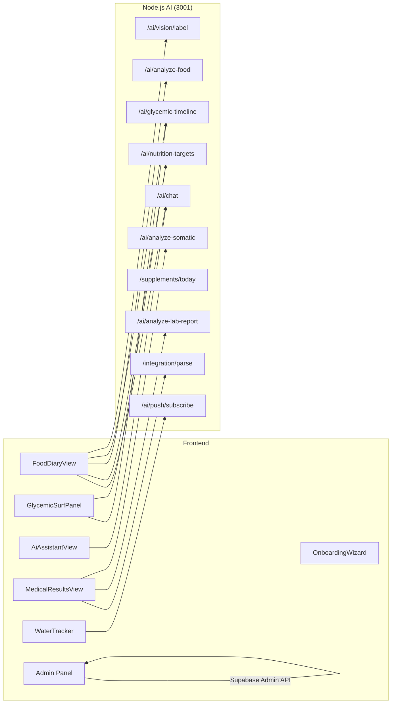

# VITOGRAPH — Frontend Component Map

> **Дата актуальности:** 25 апреля 2026 (обновлено: Glassmorphism Tabs, Capacitor Android App, FontScaleProvider, Android Auth Fixes)
>
> Карта UI-компонентов Next.js 14+ (App Router) с описанием ответственности и зависимостей, а также интеграция Android Capacitor.

---

## 1. Архитектура страницы

```
layout.tsx (RootLayout)
└── page.tsx → ClientPage.tsx
    ├── TabSwitcher (tabs: "Дневник", "Ассистент", "Анализы", "Профиль")
    │   ├── tab=0 → FoodDiaryView
    │   ├── tab=1 → AiAssistantView
    │   ├── tab=2 → MedicalResultsView
    │   └── tab=3 → UserProfileSheet
    └── login/ → Supabase Auth (SignOutButton)
```

> Приложение — **SPA с табами**. `ClientPage.tsx` содержит логику авторизации, onboarding и переключения вкладок.

---

## 2. Модули компонентов

### 2.1 `diary/` — Дневник питания

| Компонент                | Назначение                                                 | Ключевые props / state                                                      | API-зависимости                                                                     |
| :----------------------- | :--------------------------------------------------------- | :-------------------------------------------------------------------------- | :---------------------------------------------------------------------------------- |
| **FoodDiaryView**        | Главный экран дневника. Чат-интерфейс + **Scroll-to-Top FAB** (плавающая кнопка навигации)  | `messages[]`, `threadId`, `macros`, `dynamicTarget`, `dynamicMicros`        | `apiClient.chat()`, `apiClient.getNutritionTargets()`, `apiClient.getGlycemicTimeline()` |
| **FoodInputForm**        | Поле ввода + кнопка фото + кнопка отправки                 | `onSend(text, imageBase64?)`                                                | Нет (чисто UI)                                                                      |
| **ChatMessage**          | Рендер одного сообщения. Поддерживает `onRedZoneConfirm/Reject` для конфирмации продуктов красной зоны   | `variant`, `text`, `time`, `mealMicros`, `onRedZoneConfirm`, `onRedZoneReject` | Нет                                                                                 |
| **GlycemicSurfPanel**    | **Инсулиновый Сёрфинг:** интерактивная кривая, средний показатель, пики, цветные зоны, GL-бюджет, микронутриенты (~31 KB) | `timeline`, `baseline`, `zones`, `glBudget`, `micros`                       | `apiClient.getGlycemicTimeline()`, `apiClient.getNutritionTargets()`                |
| **GlycemicCurveChart**   | SVG-кривая гликемического отклика с цветными зонами (зелёный/жёлтый/красный) | `points[]`, `zones`, `width`, `height`                                      | Нет (чисто презентационный)                                                     |
| **DatePaginator**        | Переключение дат (← Сегодня →)                             | `selectedDate`, `onDateChange`                                              | Нет                                                                                 |
| **WaterTracker**         | Трекер воды с push-уведомлениями (VAPID toggle: колокольчик). Optimistic UI, timezone-aware | `glasses`, `onAdd`, `onRemove`, push bell toggle                            | Supabase `water_logs`, `usePushNotifications` hook                                  |
| **MealScoreBadge**       | Бейдж качества приёма пищи (0-100)                         | `score`, `reason`                                                           | Нет                                                                                 |
| **FoodCard**             | Карточка приёма пищи: GI zone badge, response_type, energy_hours, микронутриентовые dot-chips, mobile `pr-6` clearance | `mealData`, `mealScore`, `mealReason`, `onEdit`, `onDelete`                 | Нет (презентационный)                                                              |
| **FoodInputForm**        | Поле ввода + кнопка фото + анализ с возможностью отмены (кнопка закрытия миниатюры) | `onSend(text, imageBase64?)`                                                | Нет (чисто UI)                                                                      |
| **FeedbackButton**       | Кнопка отправки фидбека                                    | —                                                                           | `apiClient.submitFeedback()`                                                        |

---

### 2.2 `assistant/` — AI-ассистент

| Компонент           | Назначение                                                                      | API-зависимости                                                       |
| :------------------ | :------------------------------------------------------------------------------ | :-------------------------------------------------------------------- |
| **AiAssistantView** | Полноценный чат с AI-другом (режим `assistant`). Поддержка истории, изображений | `apiClient.chat(chatMode: "assistant")`, `apiClient.getChatHistory()` |

---

### 2.3 `medical/` — Анализы и диагностика

| Компонент                | Назначение                                                                            | API-зависимости                                                                                                                                                |
| :----------------------- | :------------------------------------------------------------------------------------ | :------------------------------------------------------------------------------------------------------------------------------------------------------------- |
| **MedicalResultsView**   | Оркестратор: загрузка PDF/фото, редактируемые карточки биомаркеров (Pause & Review), красная подсветка пустых полей, диагностический отчёт, соматика. **[NEW]** Батч-загрузка использует `useLabScanJob` хук с async pipeline + Realtime progress bar (UPLOADING→PENDING→PROCESSING→COMPLETED). | `apiClient.uploadFile()`, `apiClient.uploadImageFile()`, **`useLabScanJob()`** → `/parse-image-batch-async`, `apiClient.analyzeLabReport()`, `apiClient.getLabReportsHistory()`, `apiClient.getSomaticHistory()` |
| **UploadZone**           | Drag-n-drop зона для PDF/DOCX                                                         | `onFileSelect(file)`                                                                                                                                           |
| **PhotoUploader**        | Кнопка камеры для фото анализов                                                       | `onCapture(base64)`                                                                                                                                            |
| **ResultCard**           | Одиночная карточка биомаркера                                                         | `name`, `value`, `unit`, `flag`, `referenceRange`                                                                                                              |
| **DiagnosticReportCard** | Развёрнутый отчёт GPT-4o (паттерны, диета, добавки)                                   | `report`, `onDelete`                                                                                                                                           |
| **SomaticAnalysisCard**  | Результат анализа ногтей/кожи/языка                                                   | `analysis`, `type`                                                                                                                                             |
| **NailAnalysisCard**     | Специализированная карточка анализа ногтей                                            | `markers[]`, `interpretation`                                                                                                                                  |
| **SymptomTrackerWidget** | Виджет трекера симптомов (запись и отслеживание симптомов)                             | `symptoms[]`, `onAdd`, `onRemove`                                                                                                                              |

---

### 2.4 `onboarding/` — Онбординг

| Компонент            | Назначение                                                                                                                               | API-зависимости                     |
| :------------------- | :--------------------------------------------------------------------------------------------------------------------------------------- | :---------------------------------- |
| **OnboardingWizard** | 8-шаговый визард (basic → sleep → environment → activity → diet → medical → stress → exterior). Сохраняет в `profiles.lifestyle_markers` | Supabase прямой запрос к `profiles` |

**Секции визарда:**
1. Базовые метрики (рост, вес, пол, цель)
2. Сон и режим
3. Окружающая среда
4. Активность
5. Питание
6. Анамнез
7. Стресс
8. Внешние маркеры

---

### 2.5 `shared/` — Общие виджеты

| Компонент                       | Назначение                                                   | API-зависимости                                        |
| :---------------------------- | :--------------------------------------------------------- | :----------------------------------------------- |
| **SupplementChecklistWidget** | Чеклист ПАДов с протоколом (отметки приёма, UI-сетка)  | `apiClient.getSupplements()`, `apiClient.logSupplementIntake()` |
| **HealthGoalsWidget**         | Виджет управления целями по здоровью пользователя (аккордеон-панель, мобильный дизайн). Работает только в интерфейсе Ассистента. Удаление цели устанавливает `status='abandoned'` (не DELETE). | Supabase прямой запрос к `user_active_skills` (WHERE `status='active'`) |

---

### 2.6 `profile/` — Профиль

| Компонент             | Назначение                                     | API-зависимости         |
| :-------------------- | :--------------------------------------------- | :---------------------- |
| **UserProfileSheet**  | Боковая панель профиля (редактирование данных). Использует кастомную 3D-верстку вкладок (Glassmorphism, overlapping folders). | Supabase `profiles`     |
| **DeviceWidgetCard**  | Виджет подключённого устройства (wearable)     | — (будущая фича)        |
| **ManualEntryDialog** | Диалог ручного ввода биомаркера                | Supabase `test_results` |

---

### 2.7 `auth/` — Авторизация

| Компонент         | Назначение                |
| :---------------- | :------------------------ |
| **SignOutButton** | Кнопка выхода из аккаунта |

---

### 2.8 `providers/` — React Context Providers

| Компонент | Назначение |
| :--- | :--- |
| **FontScaleProvider** | React Context для глобального масштабирования шрифтов (`small` / `medium` / `large`). Персистит в `localStorage`. Применяет масштаб через `rem` на `<html>` root. Инжектируется в `RootLayout`, anti-FOUC через синхронный `<script>` в `<head>`. UI-контроль в `UserProfileSheet` («Настройки приложения»). |

### 2.9 `ui/` — Общие UI-компоненты

| Компонент       | Назначение                                         |
| :-------------- | :------------------------------------------------- |
| **Logo**        | SVG-логотип проекта (синий крест-пропеллер). **Критическая деталь:** содержит зашифрованную информацию в дробных частях координат `y2`. Нельзя изменять прозрачность. |
| **TabSwitcher** | Переключатель вкладок (внизу экрана, mobile-first) |
| **dialog.tsx**  | Переиспользуемый модальный диалог                  |
| **tabs.tsx**    | Базовый компонент табов                            |

---

### 2.10 `admin/` — Админ-панель

> **Доступ:** `app_metadata.role === "admin"`. Проверяется в `admin/layout.tsx`. Dark mode forced.

| Компонент | Назначение | Родитель | API-зависимости |
|:---|:---|:---|:---|
| **AdminSidebar** | Боковое меню навигации (обзор, пользователи, фидбэк, KB, AI настройки) | `admin/layout.tsx` | Нет |

#### `admin/users/` — Управление пользователями

| Компонент | Назначение |
|:---|:---|
| **page.tsx** | Таблица пользователей (Server Component). Supabase Admin API. |
| **UserActions** | Кнопки ban/unban, удаления, смены роли. Client component с try-catch. |
| **AddUserModal** | Модальное окно создания пользователя. |
| **CopyEmail** | Click-to-copy email с визуальным подтверждением. |
| **actions.ts** | Server Actions: createUser, banUser, unbanUser, deleteUser, updateRole. |

#### `admin/feedback/` — Обратная связь

| Компонент | Назначение |
|:---|:---|
| **page.tsx** | Таблица фидбэка с фильтрацией по статусу. |
| **StatusSelect** | Dropdown смены статуса (new/reviewed/resolved). |
| **actions.ts** | Server Action: updateFeedbackStatus. |

#### `admin/knowledge/` — База знаний (KB)

| Компонент | Назначение |
|:---|:---|
| **page.tsx** | Список KB-документов (slug, category, статус ингестии). |
| **AddDocumentModal** | Добавление нового документа в KB (заголовок, категория, Markdown). |
| **DeleteDocumentButton** | Кнопка удаления с подтверждением. |
| **actions.ts** | Server Actions: addKBDocument, deleteKBDocument. |

#### `admin/ai-settings/` — Настройки AI

| Компонент | Назначение |
|:---|:---|
| **page.tsx** | Страница настроек AI-модели. |
| **AiSettingsForm** | Форма редактирования параметров AI (модель, temperature, имя). |
| **actions.ts** | Server Action: updateAiSettings. |

---

## 3. Граф зависимостей (Component → API)



---

## 4. Ключевые файлы поддержки

| Файл                                                                               | Назначение                                                       |
| :--------------------------------------------------------------------------------- | :--------------------------------------------------------------- |
| [`nutrient-colors.ts`](file:///c:/project/VITOGRAPH/apps/web/src/lib/food-diary/nutrient-colors.ts) | Ядро цветового кодирования плашек в чате. Использует биологический/химический словарь ассоциаций + **детерминированный строковый хэшинг** для стабилизации цветов неизвестных микронутриентов. |
| [`api-client.ts`](file:///c:/project/VITOGRAPH/apps/web/src/lib/api-client.ts)     | Единый HTTP-клиент для всех API-вызовов (20KB, ~40 методов). **Android Auth:** `getAuthToken()` использует двухфазную стратегию: 1) Fast-path — чтение токена из `localStorage` (мгновенно, проверка `expires_at`), 2) Slow-path — `getSession()` с 5s race-timeout для предотвращения зависаний Android WebView |
| [`supabase/client.ts`](file:///c:/project/VITOGRAPH/apps/web/src/lib/supabase/client.ts) | Supabase Browser Client с Capacitor-спецификой: `dummyLock` (обход `navigator.locks`), Cookie Backup (`localStorage` зеркало сессии), автовосстановление при force-close |
| [`image-utils.ts`](file:///c:/project/VITOGRAPH/apps/web/src/lib/image-utils.ts)   | Сжатие изображений (canvas → blob, max 2048px для анализов, 1024px для еды)  |
| [`food-log-parser.ts`](file:///c:/project/VITOGRAPH/apps/web/src/components/diary/food-log-parser.ts) | Парсер food-лога из AI-ответов: извлечение `<meal_id>` тегов, маппинг на FoodCard |
| [`health-core.ts`](file:///c:/project/VITOGRAPH/apps/web/src/types/health-core.ts) | Основные TypeScript-типы (Profile, Biomarker, MealLog, etc.)     |
| [`middleware.ts`](file:///c:/project/VITOGRAPH/apps/web/src/middleware.ts)         | Next.js middleware для Supabase Auth (redirect неавторизованных) |
| [`useLabScanJob.ts`](file:///c:/project/VITOGRAPH/apps/web/src/hooks/useLabScanJob.ts) | React-хук для async OCR pipeline. Управляет lifecycle: `UPLOADING → PENDING → PROCESSING → COMPLETED/FAILED`. Supabase Realtime + fallback polling. |
| [`usePushNotifications.ts`](file:///c:/project/VITOGRAPH/apps/web/src/hooks/usePushNotifications.ts) | React-хук Web Push: отслеживание состояния подписки, toggle subscribe/unsubscribe, VAPID key, Service Worker. |
| [`use-typewriter.ts`](file:///c:/project/VITOGRAPH/apps/web/src/hooks/use-typewriter.ts) | Хук эффекта «печатная машинка» для SSE-стриминга AI-ответов. |
