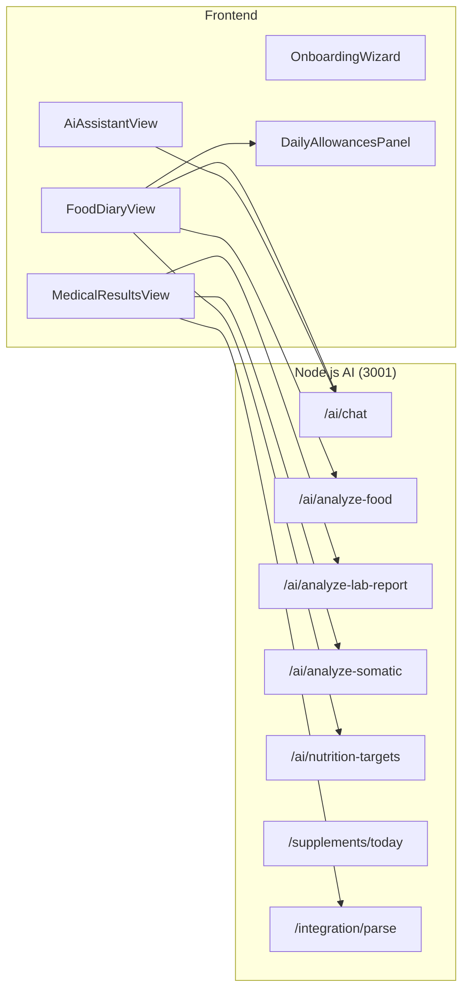

# VITOGRAPH — Frontend Component Map

> **Дата актуальности:** 29 марта 2026
>
> Карта UI-компонентов Next.js 14+ (App Router) с описанием ответственности и зависимостей.

---

## 1. Архитектура страницы

```
layout.tsx (RootLayout)
└── page.tsx → ClientPage.tsx
    ├── TabSwitcher (tabs: "Дневник", "Ассистент", "Анализы", "Профиль")
    │   ├── tab=0 → FoodDiaryView
    │   ├── tab=1 → AiAssistantView
    │   ├── tab=2 → MedicalResultsView
    │   └── tab=3 → UserProfileSheet
    └── login/ → Supabase Auth (SignOutButton)
```

> Приложение — **SPA с табами**. `ClientPage.tsx` содержит логику авторизации, onboarding и переключения вкладок.

---

## 2. Модули компонентов

### 2.1 `diary/` — Дневник питания

| Компонент                | Назначение                                                 | Ключевые props / state                                                      | API-зависимости                                                                     |
| :----------------------- | :--------------------------------------------------------- | :-------------------------------------------------------------------------- | :---------------------------------------------------------------------------------- |
| **FoodDiaryView**        | Главный экран дневника. Чат-интерфейс для логирования еды  | `messages[]`, `threadId`, `macros`, `dynamicTarget`, `dynamicMicros`        | `apiClient.chat()`, `apiClient.getNutritionTargets()`, `apiClient.getChatHistory()` |
| **FoodInputForm**        | Поле ввода + кнопка фото + кнопка отправки                 | `onSend(text, imageBase64?)`                                                | Нет (чисто UI)                                                                      |
| **ChatMessage**          | Рендер одного сообщения (user / system)                    | `variant`, `text`, `time`                                                   | Нет                                                                                 |
| **DailyAllowancesPanel** | Прогресс-бары КБЖУ + раскрывающийся список микронутриентов | `consumed`, `dynamicTarget`, `dynamicMicros`, `consumedMicros`, `rationale` | Нет (презентационный, Phase 53f)                                                    |
| **DatePaginator**        | Переключение дат (← Сегодня →)                             | `selectedDate`, `onDateChange`                                              | Нет                                                                                 |
| **WaterTracker**         | Трекер потребления воды                                    | `glasses`, `onAdd`, `onRemove`                                              | Supabase прямой запрос                                                              |
| **MealScoreBadge**       | Бейдж качества приёма пищи (0-100)                         | `score`, `reason`                                                           | Нет                                                                                 |
| **FoodCard**             | Карточка приёма пищи в чате (pills для макро, chips для микро) | `mealData`, `mealScore`, `mealReason`                                       | Нет (презентационный)                                                              |
| **FeedbackButton**       | Кнопка отправки фидбека                                    | —                                                                           | `apiClient.submitFeedback()`                                                        |

---

### 2.2 `assistant/` — AI-ассистент

| Компонент           | Назначение                                                                      | API-зависимости                                                       |
| :------------------ | :------------------------------------------------------------------------------ | :-------------------------------------------------------------------- |
| **AiAssistantView** | Полноценный чат с AI-другом (режим `assistant`). Поддержка истории, изображений | `apiClient.chat(chatMode: "assistant")`, `apiClient.getChatHistory()` |

---

### 2.3 `medical/` — Анализы и диагностика

| Компонент                | Назначение                                                                            | API-зависимости                                                                                                                                                |
| :----------------------- | :------------------------------------------------------------------------------------ | :------------------------------------------------------------------------------------------------------------------------------------------------------------- |
| **MedicalResultsView**   | Оркестратор: загрузка PDF/фото, редактируемые карточки биомаркеров (Pause & Review), красная подсветка пустых полей, диагностический отчёт, соматика | `apiClient.uploadFile()`, `apiClient.uploadImageFile()`, `apiClient.uploadImageFiles()`, `apiClient.analyzeLabReport()`, `apiClient.getLabReportsHistory()`, `apiClient.getSomaticHistory()` |
| **UploadZone**           | Drag-n-drop зона для PDF/DOCX                                                         | `onFileSelect(file)`                                                                                                                                           |
| **PhotoUploader**        | Кнопка камеры для фото анализов                                                       | `onCapture(base64)`                                                                                                                                            |
| **ResultCard**           | Одиночная карточка биомаркера                                                         | `name`, `value`, `unit`, `flag`, `referenceRange`                                                                                                              |
| **DiagnosticReportCard** | Развёрнутый отчёт GPT-4o (паттерны, диета, добавки)                                   | `report`, `onDelete`                                                                                                                                           |
| **SomaticAnalysisCard**  | Результат анализа ногтей/кожи/языка                                                   | `analysis`, `type`                                                                                                                                             |
| **NailAnalysisCard**     | Специализированная карточка анализа ногтей                                            | `markers[]`, `interpretation`                                                                                                                                  |
| **SymptomTrackerWidget** | Виджет трекера симптомов (запись и отслеживание симптомов)                             | `symptoms[]`, `onAdd`, `onRemove`                                                                                                                              |

---

### 2.4 `onboarding/` — Онбординг

| Компонент            | Назначение                                                                                                                               | API-зависимости                     |
| :------------------- | :--------------------------------------------------------------------------------------------------------------------------------------- | :---------------------------------- |
| **OnboardingWizard** | 8-шаговый визард (basic → sleep → environment → activity → diet → medical → stress → exterior). Сохраняет в `profiles.lifestyle_markers` | Supabase прямой запрос к `profiles` |

**Секции визарда:**
1. Базовые метрики (рост, вес, пол, цель)
2. Сон и режим
3. Окружающая среда
4. Активность
5. Питание
6. Анамнез
7. Стресс
8. Внешние маркеры

---

### 2.5 `shared/` — Общие виджеты

| Компонент                       | Назначение                                                   | API-зависимости                                        |
| :---------------------------- | :--------------------------------------------------------- | :----------------------------------------------- |
| **SupplementChecklistWidget** | Чеклист ПАДов с протоколом (отметки приёма, UI-сетка)  | `apiClient.getSupplements()`, `apiClient.logSupplementIntake()` |
| **HealthGoalsWidget**         | Виджет управления целями по здоровью пользователя (с подсказкой при пустом состоянии). Работает только в интерфейсе Ассистента (удален из Дневника для компактности). | `profiles.health_goals` |

---

### 2.6 `profile/` — Профиль

| Компонент             | Назначение                                     | API-зависимости         |
| :-------------------- | :--------------------------------------------- | :---------------------- |
| **UserProfileSheet**  | Боковая панель профиля (редактирование данных) | Supabase `profiles`     |
| **DeviceWidgetCard**  | Виджет подключённого устройства (wearable)     | — (будущая фича)        |
| **ManualEntryDialog** | Диалог ручного ввода биомаркера                | Supabase `test_results` |

---

### 2.7 `auth/` — Авторизация

| Компонент         | Назначение                |
| :---------------- | :------------------------ |
| **SignOutButton** | Кнопка выхода из аккаунта |

---

### 2.8 `ui/` — Общие UI-компоненты

| Компонент       | Назначение                                         |
| :-------------- | :------------------------------------------------- |
| **Logo**        | SVG-логотип проекта (синий крест-пропеллер). **Критическая деталь:** содержит зашифрованную информацию в дробных частях координат `y2`. Нельзя изменять прозрачность. |
| **TabSwitcher** | Переключатель вкладок (внизу экрана, mobile-first) |
| **dialog.tsx**  | Переиспользуемый модальный диалог                  |
| **tabs.tsx**    | Базовый компонент табов                            |

---

## 3. Граф зависимостей (Component → API)



---

## 4. Ключевые файлы поддержки

| Файл                                                                               | Назначение                                                       |
| :--------------------------------------------------------------------------------- | :--------------------------------------------------------------- |
| [`nutrient-colors.ts`](file:///c:/project/VITOGRAPH/apps/web/src/lib/food-diary/nutrient-colors.ts) | Ядро цветового кодирования плашек в чате. Использует биологический/химический словарь ассоциаций + **детерминированный строковый хэшинг** для стабилизации цветов неизвестных микронутриентов. |
| [`api-client.ts`](file:///c:/project/VITOGRAPH/apps/web/src/lib/api-client.ts)     | Единый HTTP-клиент для всех API-вызовов (20KB, ~40 методов)      |
| [`image-utils.ts`](file:///c:/project/VITOGRAPH/apps/web/src/lib/image-utils.ts)   | Сжатие изображений (canvas → blob, max 2048px для анализов, 1024px для еды)  |
| [`health-core.ts`](file:///c:/project/VITOGRAPH/apps/web/src/types/health-core.ts) | Основные TypeScript-типы (Profile, Biomarker, MealLog, etc.)     |
| [`middleware.ts`](file:///c:/project/VITOGRAPH/apps/web/src/middleware.ts)         | Next.js middleware для Supabase Auth (redirect неавторизованных) |
