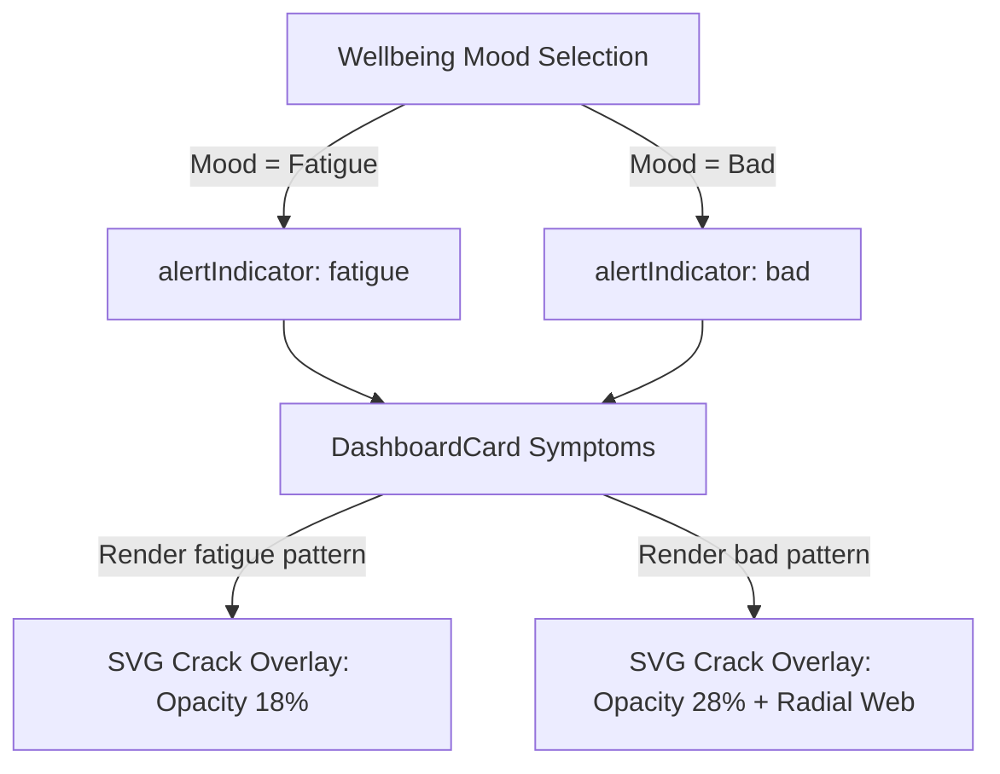

# Architecture Specification: Glass Crack Visual Effect

This document specifies the design and implementation of the "Glass Crack" (трещины по стеклу) visual overlay for the Vitograph Mobile Dashboard cards when the user's wellbeing status is in warning or critical ranges.

## 1. Overview
To enhance the premium visual feedback of the wellbeing dashboard, warning states ("Fatigue" and "Bad") will trigger a decorative broken glass effect on the corresponding card (typically "Symptoms Today"). This effect represents somatic stress or system fatigue.



## 2. Visual Design & Mechanics

### Impact Origin
The cracks originate from the warning/alert dot located in the top-right corner of the card (approximate coordinates `(x: 85%, y: 15%)` relative to the container). This anchors the effect to a physical visual element, making it look organic.

### Crack Profiles
1. **Fatigue (Усталость):**
   - Light damage.
   - 3-4 jagged radial cracks extending outwards.
   - Stroke color: White (`rgba(255, 255, 255, 0.18)`).
   - Dynamic stroke width: `0.5px`.

2. **Bad (Плохо):**
   - High damage.
   - 5-6 jagged radial cracks with secondary branching.
   - Concentric tension rings (spiderweb pattern) around the impact origin.
   - Stroke color: Muted white-rose (`rgba(255, 240, 240, 0.28)`).
   - Dynamic stroke width: `0.6px` to `0.8px` for primary lines, `0.4px` for secondary tension lines.

## 3. Integration & Code Separation

To prevent styling conflicts:
- The SVG element is positioned absolutely at `z-0` within the card container.
- It sits below the header (`z-10`) and footer (`z-10`) sections to ensure 100% readability of titles, descriptions, and buttons.
- `pointer-events-none` is applied to ensure that touch/click interaction propagates correctly to the container card without any interference.
- `select-none` is added to prevent user selection of the decorative paths.

## 4. Key Paths & Math
The coordinates inside the `viewBox="0 0 100 100"` are designed to be scale-invariant (`preserveAspectRatio="none"` or `preserveAspectRatio="xMidYMid slice"` depending on visual scaling preferences). We use `preserveAspectRatio="none"` to allow the cracks to scale along with the card's aspect ratio.

```xml
<!-- Example fatigue paths starting at (85, 15) -->
<path d="M85,15 L78,22 L70,20 L62,28 L50,25 L40,32 M85,15 L79,32 L75,45 L68,60 L62,80" ... />
```
