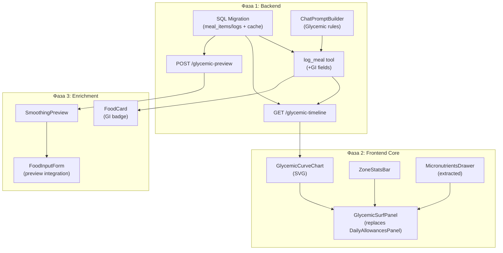

# VITOGRAPH — Архитектура «Инсулиновый Сёрфинг»

> **Дата:** 19 апреля 2026 (Реализовано 20 апреля 2026)
> **Статус:** [РЕАЛИЗОВАНО - v2.0]
> **Тип:** Рефакторинг Дневника (Major Feature)

---

## 1. Executive Summary

Полная замена панели КБЖУ (`DailyAllowancesPanel`) на интерактивную **Шкалу Гликемического Покоя** — визуализацию инсулинового отклика в реальном времени. 

| Аспект | Было (КБЖУ) | Станет (Инсулиновый Сёрфинг) |
|:---|:---|:---|
| **Центральный элемент** | Круговой прогресс калорий + 3 бара (БЖУ) | Динамическая кривая гликемического отклика на 24ч |
| **Мотивация** | «Осталось X ккал» | «Продержись в зелёном коридоре» |
| **Обратная связь** | Проценты заполнения баров | Прогноз на 3ч после каждого приёма пищи |
| **Индивидуальность** | Расчёт через профиль | Учёт анализов крови (глюкоза, HbA1c, инсулин) |
| **Геймификация** | Нет | Счётчик «часов в зоне», streak, уровни |

---

## 2. Модель данных

### 2.1 Расширение `meal_items` (существующая таблица)

Добавляем новые колонки для хранения гликемического профиля каждого продукта:

```sql
ALTER TABLE meal_items ADD COLUMN IF NOT EXISTS glycemic_index   SMALLINT;        -- 0-100 (GI продукта)
ALTER TABLE meal_items ADD COLUMN IF NOT EXISTS glycemic_load    REAL;             -- GI × carbs_g / 100
ALTER TABLE meal_items ADD COLUMN IF NOT EXISTS insulin_index    SMALLINT;         -- 0-150 (для мяса, молочки)
ALTER TABLE meal_items ADD COLUMN IF NOT EXISTS response_type    TEXT DEFAULT 'moderate'; -- 'flat' | 'moderate' | 'spike'
ALTER TABLE meal_items ADD COLUMN IF NOT EXISTS peak_time_min    SMALLINT;         -- Время пика (мин после приёма)
ALTER TABLE meal_items ADD COLUMN IF NOT EXISTS energy_duration_hours REAL;        -- Длительность энергии (часы)
```

### 2.2 Расширение `meal_logs` (существующая таблица)

Агрегированный гликемический профиль приёма пищи:

```sql
ALTER TABLE meal_logs ADD COLUMN IF NOT EXISTS glycemic_load_total   REAL;        -- Суммарная GL приёма
ALTER TABLE meal_logs ADD COLUMN IF NOT EXISTS response_type         TEXT;        -- 'flat' | 'moderate' | 'spike'
ALTER TABLE meal_logs ADD COLUMN IF NOT EXISTS predicted_peak_mg_dl  REAL;        -- Прогноз пика сахара (мг/дл)
ALTER TABLE meal_logs ADD COLUMN IF NOT EXISTS predicted_nadir_min   SMALLINT;    -- Через сколько минут — надир (упадок)
```

### 2.3 Новая таблица: `food_glycemic_cache`

Кэш GI/II значений для повторяющихся продуктов (чтобы не пересчитывать через LLM каждый раз):

```sql
CREATE TABLE IF NOT EXISTS food_glycemic_cache (
  id            SERIAL PRIMARY KEY,
  food_name_key TEXT NOT NULL UNIQUE,     -- normalized lowercase key
  glycemic_index   SMALLINT NOT NULL,
  insulin_index    SMALLINT,
  response_type    TEXT NOT NULL DEFAULT 'moderate',
  peak_time_min    SMALLINT DEFAULT 30,
  energy_duration_hours REAL DEFAULT 2.0,
  source        TEXT DEFAULT 'llm',        -- 'llm' | 'manual' | 'publication'
  confidence    REAL DEFAULT 0.7,          -- 0.0-1.0
  created_at    TIMESTAMPTZ DEFAULT NOW(),
  updated_at    TIMESTAMPTZ DEFAULT NOW()
);

CREATE INDEX idx_food_gi_cache_name ON food_glycemic_cache (food_name_key);
```

### 2.4 Расширение `profiles` (lifestyle_markers JSONB)

Персонализация кривых по анализам пользователя:

```jsonc
// profiles.lifestyle_markers (добавить к существующим):
{
  "glycemic_sensitivity": "normal",     // "normal" | "elevated" | "prediabetic" | "diabetic"
  "fasting_glucose_mg_dl": null,        // Из последнего анализа (auto-populate)
  "hba1c_percent": null,                // Из последнего анализа
  "insulin_fasting_mU_L": null          // Из последнего анализа
}
```

> **Автозаполнение:** AI-pipeline при обработке lab report (`handleAnalyzeLabReport`) будет автоматически обновлять эти поля, если найдёт соответствующие биомаркеры.

---

## 3. Математическая модель кривой

### 3.1 Базовая формула (Minimal Viable Curve)

Для каждого приёма пищи мы генерируем кривую R(t):

```
R(t) = baseline + amplitude × (t / peak)^a × e^(-b × (t - peak))
```

Где:
- `baseline` = 85–95 мг/дл (зависит от `fasting_glucose_mg_dl` пользователя)
- `amplitude` = f(glycemic_load_total, glycemic_sensitivity)
- `peak` = `peak_time_min` (из meal_log или default 30 мин)
- `a` = 2 (крутизна подъёма)
- `b` = коэффициент спада (зависит от `response_type`: flat=0.02, moderate=0.04, spike=0.08)

### 3.2 Суперпозиция

Timeline за день = сумма всех R_i(t - t_meal_i) для каждого приёма пищи. Это даёт реалистичную картину волн и наложений.

### 3.3 Зоны кривой

| Зона | Диапазон (мг/дл) | Цвет | Эмоция |
|:---|:---|:---|:---|
| 🟢 Зелёный коридор | 70–110 | `#10B981` | «Фокус и энергия» |
| 🟡 Жёлтая зона | 110–140 | `#F59E0B` | «Терпимо, но не идеально» |
| 🔴 Красная зона | >140 | `#EF4444` | «Сахарная игла / инсулиновый шторм» |
| 🔵 Синяя зона (низ) | <70 | `#3B82F6` | «Упадок сил, голод» |

### 3.4 Персонализация

Коэффициент `glycemic_sensitivity_factor`:
- `normal` → × 1.0
- `elevated` → × 1.3 (более крутые пики)
- `prediabetic` → × 1.6
- `diabetic` → × 2.0

---

## 4. API-контракты

### 4.1 Модификация `log_meal` tool (tools.ts)

Добавить в Zod-схему и в ответ:

```typescript
// Новые поля в schema:
glycemic_index: z.number().optional().describe("Estimated GI of the food (0-100)"),
insulin_index: z.number().optional().describe("Insulin Index if different from GI (e.g., dairy)"),
response_type: z.enum(["flat", "moderate", "spike"]).optional(),
peak_time_min: z.number().optional().describe("Minutes until glucose peak"),
energy_duration_hours: z.number().optional().describe("How long the energy lasts in hours"),
```

В ответе LLM-tool дополнительно возвращает:
```
glycemic_data: { gi: 35, gl: 12.5, response: "flat", peak_min: 45, energy_h: 4.5 }
```

### 4.2 Новый endpoint: `GET /api/v1/ai/glycemic-timeline`

```typescript
// Query: ?date=YYYY-MM-DD&timezone=Asia/Singapore
// Response:
{
  "timeline": [
    { "time_min": 0,   "glucose_mg_dl": 90, "zone": "green" },
    { "time_min": 15,  "glucose_mg_dl": 95, "zone": "green" },
    { "time_min": 30,  "glucose_mg_dl": 125, "zone": "yellow" },
    // ... каждые 5 минут на 24 часа (288 точек)
  ],
  "meals": [
    { "time_iso": "...", "food_name": "...", "gl": 35, "response": "spike" }
  ],
  "stats": {
    "hours_in_green": 18.5,
    "hours_in_yellow": 4.0,
    "hours_in_red": 1.5,
    "max_spike_mg_dl": 165,
    "average_glucose_mg_dl": 98
  },
  "user_sensitivity": "normal",
  "baseline_mg_dl": 90
}
```

### 4.3 Новый endpoint: `POST /api/v1/ai/glycemic-preview`

Для функции «Предпросмотр перед добавлением»:

```typescript
// Body:
{
  "food_name": "Белый хлеб",
  "weight_g": 100,
  "current_timeline": [...], // текущая кривая (или ID дня)
  "additions": ["салат", "авокадо"]  // опционально: продукты-сглаживатели
}

// Response:
{
  "preview_curve": [...],          // Как будет выглядеть кривая ПОСЛЕ добавления
  "delta_curve": [...],            // Разница с текущей кривой
  "response_type": "spike",       
  "peak_mg_dl": 155,
  "smoothing_suggestions": [
    { "add": "Салат из свежих овощей", "reduction_percent": 35, "new_response": "moderate" },
    { "add": "Авокадо (50г)", "reduction_percent": 40, "new_response": "flat" }
  ]
}
```

---

## 5. Компоненты Frontend

### 5.1 Удаляемые / заменяемые компоненты

| Компонент | Действие | Причина |
|:---|:---|:---|
| `DailyAllowancesPanel` | **ЗАМЕНИТЬ** → `GlycemicSurfPanel` | Центральная панель меняется целиком |
| Калорийное кольцо (SVG circle) | **УДАЛИТЬ** | Больше не показываем КБЖУ как центральный элемент |
| MACROS_CONFIG (3 бара БЖУ) | **УДАЛИТЬ** | Заменяется на glycemic curve |
| Микронутриенты (expand panel) | **СОХРАНИТЬ** но перенести | Микронутриенты остаются, но в collapsible внутри новой панели |

### 5.2 Новые компоненты

```
diary/
├── GlycemicSurfPanel.tsx        ← [NEW] Главная панель (заменяет DailyAllowancesPanel)
│   ├── GlycemicCurveChart.tsx   ← [NEW] SVG/Canvas график кривой с зонами
│   ├── ZoneStatsBar.tsx         ← [NEW] "18ч в 🟢 | 4ч в 🟡 | 1.5ч в 🔴"
│   └── MicronutrientsDrawer.tsx ← [EXTRACTED] Перенесённая панель микронутриентов
├── SmoothingPreview.tsx         ← [NEW] Модалка "Добавь овощи чтобы сгладить"  
├── FoodCard.tsx                 ← [MODIFY] Заменить КБЖУ pills → GI response badge
└── FoodDiaryView.tsx            ← [MODIFY] Подключить новые компоненты
```

### 5.3 `GlycemicSurfPanel` — Спецификация

**Визуальная иерархия (сверху вниз):**

1. **Header:** «Инсулиновый сёрфинг» + ZoneStatsBar (green/yellow/red часы)
2. **Graph:** Интерактивный SVG-график (24ч timeline, touch-friendly)
   - Зелёный коридор (70-110) — полупрозрачный бэкграунд
   - Кривая — gradient stroke (зелёный → жёлтый → красный по амплитуде)
   - Маркеры приёмов пищи — точки с эмодзи еды
   - Ползунок «сейчас» — вертикальная пунктирная линия
3. **Quick Stats:** Карточки вместо макросов:
   - 📊 Max пик сегодня: 125 мг/дл
   - ⏱️ Зелёный коридор: 18.5ч 
   - 🎯 Streak: 3 дня подряд > 80% в зоне
4. **Микронутриенты** (collapsed по умолч.)

### 5.4 Модификация `FoodCard`

Заменяем 4 КБЖУ pills на:

```
┌─────────────────────────────────────────────┐
│  🥩 Стейк с брокколи           [85/100]     │
│  350 г                                       │
│                                               │
│  ▬ Ровный отклик  •  4-5ч энергии  •  GI: 15│
│                                               │
│  [мини-кривая прогноза на 3ч]                │
│  ▪ Витамин B12 (3.2мкг) ▪ Железо (4.5мг)   │
│                                      14:54   │
└─────────────────────────────────────────────┘
```

---

## 6. Интеграция с AI Engine

### 6.1 Модификация `withDiaryMode()` — ChatPromptBuilder

Добавить правила для LLM:

```
### GLYCEMIC SURFING MODE (REPLACING CALORIE COUNTING)
- NEVER mention calories, КБЖУ, or macros as the PRIMARY metric.
- Instead, evaluate every food by its GLYCEMIC IMPACT:
  - Estimate GI (0-100), response_type (flat/moderate/spike), peak_time_min.
  - If food causes a "spike" (GI > 70), PROACTIVELY suggest "smoothing" additions.
- Use the language of "energy waves": "плавная волна", "сахарная игла", "зеленый коридор".
- After logging, mention the glycemic impact FIRST, then secondary data.
```

### 6.2 Модификация `withDeficitAwareRule()` → `withGlycemicAwareRule()`

```
### ⚠️ GLYCEMIC-AWARE FOOD ADVICE RULE
When the user asks what to eat:
1. Check current glycemic timeline status.
2. If user has been in GREEN zone for 3+ hours → suggest low-GI maintenance foods.
3. If user is in YELLOW/RED zone → suggest fiber/protein-rich foods to "flatten the curve".
4. NEVER recommend high-GI foods (GI > 70) without pairing them with fiber/fat.
5. Use "smoothing" language: "Добавь к этому овощи, чтобы сгладить пик на 40%".
```

### 6.3 Модификация `log_meal` tool

Обязательные новые поля в Zod-schema + описания для LLM:

```
glycemic_index: z.number().min(0).max(100).describe(
  "Glycemic Index of the food (0-100). Low: 0-55, Medium: 56-69, High: 70+. " +
  "Use standard GI tables. For mixed meals, estimate weighted average."
),
response_type: z.enum(["flat", "moderate", "spike"]).describe(
  "flat: GI < 40 (slow release), moderate: GI 40-69, spike: GI 70+ (rapid glucose surge)"
),
```

---

## 7. Миграционная стратегия

### Фаза 1: Backend Foundation (неделя 1)
- [ ] SQL миграция: `food_glycemic_cache` + ALTER TABLE meal_items/meal_logs
- [ ] Расширить `log_meal` tool (Zod + func): новые GI поля
- [ ] Создать endpoint `GET /glycemic-timeline` (расчёт кривой на сервере)
- [ ] Создать endpoint `POST /glycemic-preview`
- [ ] Обновить `ChatPromptBuilder` (заменить КБЖУ-правила на Glycemic Surfing)

### Фаза 2: Frontend Core (неделя 2)
- [ ] Создать `GlycemicCurveChart` (SVG-график с зонами)
- [ ] Создать `GlycemicSurfPanel` (замена DailyAllowancesPanel)
- [ ] Создать `ZoneStatsBar` (часовая сводка по зонам)
- [ ] Извлечь микронутриенты в `MicronutrientsDrawer`
- [ ] Подключить в `FoodDiaryView` (swap панелей)

### Фаза 3: Enrichment (неделя 3)
- [ ] Модифицировать `FoodCard` (GI badge вместо КБЖУ pills)
- [ ] Создать `SmoothingPreview` (предпросмотр + предложения)
- [ ] Интегрировать `glycemic-preview` API в `FoodInputForm`
- [ ] Геймификация: streak counter, уровни «сёрфера»

### Фаза 4: Polish & Migration (неделя 4)
- [ ] Кэширование GI через `food_glycemic_cache`
- [ ] Автозаполнение `glycemic_sensitivity` из lab reports
- [ ] Продуктовый рейтинг в профиле пользователя
- [ ] A/B переключатель (КБЖУ / Сёрфинг) на период перехода
- [ ] Удаление старого `DailyAllowancesPanel`

---

## 8. Резолюция по архитектуре (v2.0)

> [!NOTE]
> Окончательно решено и реализовано: полное скрытие КБЖУ в UI, переход исключительно на метрики Insulin Surfing. 
> Микронутриенты остались в collapsed drawer `GlycemicSurfPanel`. FoodCard использует визуальные `GI badges` вместо макросных `pills`.

---

## 9. Граф зависимостей



---

## 12. Реализованные фронтенд-компоненты

> **Добавлено:** 20 апреля 2026

### 12.1 `GlycemicSurfPanel` (~31 KB)

Крупнейший компонент дневника. Заменяет старый `DailyAllowancesPanel` (КБЖУ).

| Функция | Описание |
|:--|:--|
| **Гликемическая кривая** | Интерактивный SVG-график 24ч через `GlycemicCurveChart` |
| **Средний GI** | Цветной индикатор (зелёный/жёлтый/красный) |
| **GL-бюджет** | Прогресс-бар с лимитом и текущим потреблением |
| **Пики** | Маркеры пиковых значений на кривой |
| **Микронутриенты** | Chip-бейджи с цветовым кодированием (`nutrient-colors.ts`) |

### 12.2 `GlycemicCurveChart` (~9.8 KB)

Чисто презентационный SVG-компонент. Рисует гладкую кривую гликемического отклика с цветными зонами:

| Зона | Цвет | Значение GL |
|:--|:--|:--|
| Покой (flat) | Зелёный | < 55 |
| Умеренный (moderate) | Жёлтый | 55-69 |
| Пик (spike) | Красный | ≥ 70 |

### 12.3 Scroll-to-Top FAB

Плавающая кнопка навигации в `FoodDiaryView`:
- **Позиция:** `bottom-[210px] right-0.5` (mobile)
- **Collision Avoidance:** `FoodCard` footer получает `pr-6` на mobile для создания "коридора"
- **Responsive:** Коридор применяется только на `< sm` (Tailwind prefix)
