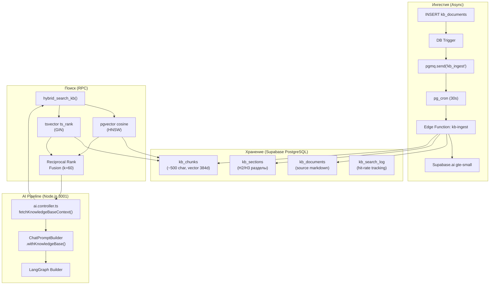
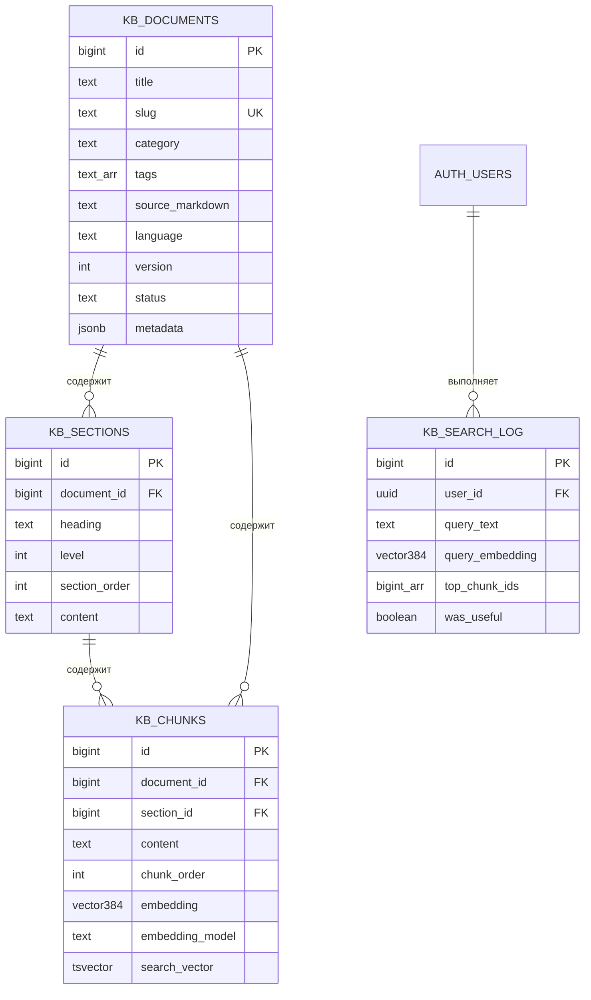
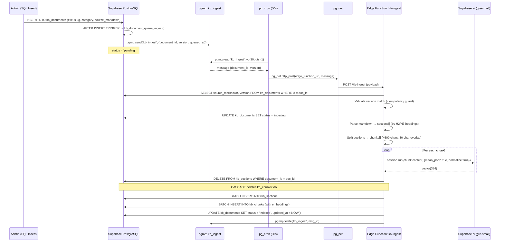
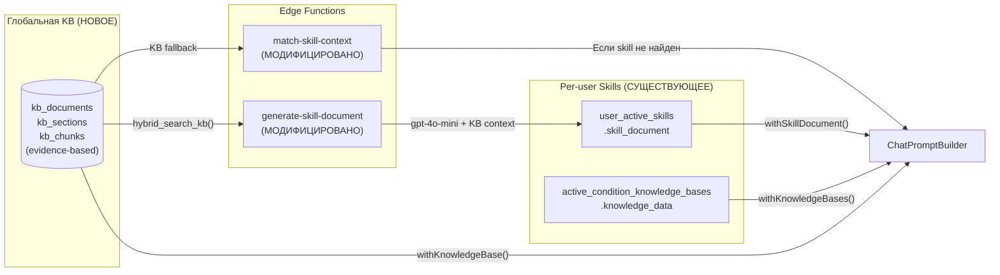

# VITOGRAPH — Knowledge Base Architecture (Health Skills)

> **Дата актуальности:** 8 апреля 2026
> **Статус:** Approved, pending implementation

---

## 1. Обзор

Knowledge Base (KB) — система хранения и автоматического извлечения медицинских скиллов (протоколов по ведению здоровья). Позволяет AI-ассистенту получать доступ к структурированным знаниям при ответе на вопросы пользователей.

### Ключевые принципы
- **Semantic Offloading:** максимум нагрузки на Supabase (pgvector, pgmq, pg_cron, Edge Functions)
- **Иерархический chunking:** document → section → chunk (parent-child retrieval)
- **Гибридный поиск:** tsvector (лексический) + pgvector (семантический) + RRF fusion
- **Автоматическая ингестия:** INSERT документа → trigger → queue → Edge Function → embeddings
- **Zero-cost embeddings:** gte-small через Supabase.ai (бесплатно, 384d)

---

## 2. Архитектура



---

## 3. Database Schema

### 3.1 `kb_documents` — Мастер-таблица документов

| Column | Type | Constraints / Notes |
|:---|:---|:---|
| `id` | `bigint identity` | PK |
| `title` | `text` | NOT NULL. Человекочитаемое название скилла |
| `slug` | `text` | UNIQUE. URL-safe идентификатор, e.g. `iron-deficiency-protocol` |
| `category` | `text` | CHECK: `nutrition`, `supplements`, `lifestyle`, `diagnostics`, `mental_health`, `sleep`, `exercise`, `condition_protocol`, `biohacking`, `general` |
| `tags` | `text[]` | Свободные теги для фильтрации. GIN index |
| `source_markdown` | `text` | NOT NULL. Полный markdown документа |
| `language` | `text` | Default `'ru'`. Используется для FTS dictionary |
| `version` | `int` | Default `1`. Инкрементируется при обновлении контента |
| `status` | `text` | CHECK: `pending`, `indexing`, `indexed`, `error` |
| `error_message` | `text` | Nullable. Заполняется при `status = 'error'` |
| `metadata` | `jsonb` | Расширяемое: author, difficulty, target_audience, etc. |
| `created_at` | `timestamptz` | Default `now()` |
| `updated_at` | `timestamptz` | Default `now()` |

> **Indexes:** `category`, `status`, `tags (GIN)`
> **RLS:** SELECT для authenticated, ALL для service_role

### 3.2 `kb_sections` — Разделы документа (H2/H3)

| Column | Type | Constraints / Notes |
|:---|:---|:---|
| `id` | `bigint identity` | PK |
| `document_id` | `bigint` | FK → `kb_documents(id)` ON DELETE CASCADE |
| `heading` | `text` | NOT NULL. Текст заголовка |
| `level` | `int` | CHECK: 1, 2, 3 (H1, H2, H3) |
| `section_order` | `int` | NOT NULL. Порядок внутри документа |
| `content` | `text` | NOT NULL. Полный текст секции (для parent context) |
| `created_at` | `timestamptz` | Default `now()` |

> **Indexes:** `(document_id, section_order)`
> **RLS:** SELECT для authenticated, ALL для service_role

### 3.3 `kb_chunks` — Атомарные чанки с эмбеддингами

| Column | Type | Constraints / Notes |
|:---|:---|:---|
| `id` | `bigint identity` | PK |
| `document_id` | `bigint` | FK → `kb_documents(id)` ON DELETE CASCADE |
| `section_id` | `bigint` | FK → `kb_sections(id)` ON DELETE CASCADE. Nullable |
| `content` | `text` | NOT NULL. Текст чанка (~500 символов) |
| `chunk_order` | `int` | NOT NULL. Порядок внутри секции |
| `char_start` | `int` | Offset начала в source_markdown |
| `char_end` | `int` | Offset конца |
| `token_count` | `int` | Приблизительное количество токенов |
| `embedding` | `vector(384)` | Эмбеддинг gte-small. HNSW index |
| `embedding_model` | `text` | Default `'gte-small-v1'`. Версионирование модели |
| `search_vector` | `tsvector` | GENERATED ALWAYS AS `to_tsvector('russian', content)` STORED |
| `metadata` | `jsonb` | Chunk-level метаданные |
| `created_at` | `timestamptz` | Default `now()` |

> **Indexes:** HNSW на `embedding`, GIN на `search_vector`, `(document_id, chunk_order)`, `section_id`
> **RLS:** SELECT для authenticated, ALL для service_role

### 3.4 `kb_search_log` — Hit-rate tracking

| Column | Type | Notes |
|:---|:---|:---|
| `id` | `bigint identity` | PK |
| `user_id` | `uuid` | FK → auth.users, ON DELETE SET NULL |
| `query_text` | `text` | NOT NULL |
| `query_embedding` | `vector(384)` | |
| `results_count` | `int` | |
| `top_chunk_ids` | `bigint[]` | |
| `top_scores` | `float[]` | |
| `category_filter` | `text` | |
| `was_useful` | `boolean` | Feedback |
| `created_at` | `timestamptz` | Default `now()` |

> **RLS:** ALL для service_role only

---

## 4. ER-диаграмма



---

## 5. Ingestion Pipeline

### 5.1 Flow



### 5.2 Chunking Algorithm

```
Input: source_markdown (full document text)

1. Split by H2/H3 headings → sections[]
   - Regex: /^#{2,3}\s+(.+)$/gm
   - Each section includes: heading, level, content (text between headings)

2. For each section:
   a. Split content by paragraphs (\n\n)
   b. Accumulate paragraphs into chunks until ~500 chars
   c. When chunk exceeds 500 chars → finalize, start new chunk
   d. Include overlap: last 80 chars of previous chunk prepended to next
   e. If paragraph < 100 chars → merge with previous chunk
   
3. For each chunk:
   a. Estimate token_count ≈ content.length / 4
   b. Record char_start, char_end offsets
   c. Generate embedding via gte-small
```

### 5.3 Idempotency Guard

При обработке сообщения из pgmq, Edge Function проверяет:
```
IF document.version !== message.version → SKIP (outdated task)
IF document.status === 'indexed' AND document.updated_at > message.queued_at → SKIP
```

Это решает race condition при быстрых consecutive updates (C2 из Debate Protocol).

---

## 6. Hybrid Search (RRF)

### 6.1 Алгоритм

```
Input: query_text, query_embedding (vector 384d), top_k, category_filter

Step 1 — Semantic Search:
  SELECT chunk_id, cosine_similarity
  FROM kb_chunks
  WHERE embedding IS NOT NULL
  ORDER BY embedding <=> query_embedding
  LIMIT top_k * 3

Step 2 — Lexical Search:
  SELECT chunk_id, ts_rank_cd(search_vector, websearch_to_tsquery('russian', query_text))
  FROM kb_chunks  
  WHERE search_vector @@ websearch_to_tsquery('russian', query_text)
  LIMIT top_k * 3

Step 3 — RRF Fusion:
  score(d) = Σ 1/(k + rank_semantic(d)) + 1/(k + rank_lexical(d))
  k = 60 (smoothing constant)
  
Step 4 — Enrich with parent context:
  JOIN kb_sections for section_heading + section_content
  JOIN kb_documents for document_title, slug, category

Output: top_k results with (content, section_heading, section_content, document_title, rrf_score)
```

### 6.2 RPC Function

```sql
hybrid_search_kb(
    p_query_text TEXT,
    p_query_embedding vector(384),
    p_top_k INT DEFAULT 5,
    p_category TEXT DEFAULT NULL,
    p_rrf_k INT DEFAULT 60
) → TABLE (chunk_id, content, section_heading, section_content, 
           document_title, document_slug, category, 
           semantic_score, lexical_score, rrf_score)
```

---

## 7. Integration с AI Pipeline

### 7.1 Data Flow

```
User message arrives at handleChat/handleChatStream
    │
    ├── [parallel] fetchUserContext()
    ├── [parallel] fetchAdvancedMemoryContext()
    ├── [parallel] fetchActiveSkills()
    ├── [parallel] fetchKnowledgeBaseContext()     ← NEW
    │       ├── embedQuery(userMessage) via singleton OpenAIEmbeddings
    │       └── RPC hybrid_search_kb(query, embedding, top_k=3, category)
    │
    ▼
ChatPromptBuilder
    ...existing methods...
    .withKnowledgeBase(kbResults)                  ← NEW (Priority P2)
    .build()
```

### 7.2 Routing Logic

`fetchKnowledgeBaseContext()` вызывается НЕ для каждого сообщения, а по condition:
- Если у пользователя есть active skills → всегда ищем по skill.diagnosis_basis.pattern
- Если сообщение содержит медицинские термины (heuristic) → ищем по всей KB
- Fallback: не вызывается для бытовых сообщений ("привет", "записал")

### 7.3 ChatPromptBuilder Section

```
### KNOWLEDGE BASE CONTEXT
Ниже приведены релевантные материалы из базы медицинских знаний.
Используй эту информацию для обоснования своих рекомендаций.

**[{document_title}] — {section_heading}**
{chunk_content}

**[{document_title_2}] — {section_heading_2}**
{chunk_content_2}
```

Приоритет: P2 (после Supplement Protocol, перед Chronic Conditions).
Estimated tokens: ~600-900 (3 чанка × ~200 токенов).

---

## 8. Embedding Strategy

| Контекст | Модель | Размерность | Стоимость |
|:---|:---|:---|:---|
| KB chunks (новое) | gte-small (Supabase.ai) | 384d | Бесплатно |
| KB search query | gte-small (Supabase.ai) | 384d | Бесплатно |
| Episodic memory | text-embedding-3-small (OpenAI) | 384d | Платно |
| Skill documents | gte-small (Supabase.ai) | 384d | Бесплатно |

> **Решение:** Единая размерность 384d для всей системы. KB embeddings генерируются через Supabase.ai (бесплатно). Для search query в Node.js — также Supabase.ai через Edge Function `match-skill-context` (reuse pattern).

## 9. Интеграция с существующей системой скиллов

> **КРИТИЧНО:** KB не заменяет, а УСИЛИВАЕТ существующую систему `user_active_skills`.

### 9.1 Текущая система (what exists)

```
user_active_skills (per-user)          active_condition_knowledge_bases (per-user)
├── skill_document (LLM-generated)     ├── knowledge_data (structured JSON)
├── skill_embedding vector(384)        ├── cofactors[], inhibitors[]
├── status FSM                         └── lifestyle_rules[]
└── steps[] JSONB                      
```

Обе системы содержат медицинские знания, но:
- `skill_document` — **чистый LLM-синтез** (gpt-4o-mini генерит "из головы")
- `knowledge_data` — **structured JSON** от lab-report-analyzer
- **Ни одна из них не ссылается на проверенные медицинские источники**

### 9.2 KB-backed система (new architecture)



### 9.3 Точки интеграции

| Компонент | Модификация | Эффект |
|:---|:---|:---|
| `generate-skill-document` EF | KB lookup **ДО** вызова OpenAI | Протокол теперь evidence-based |
| `match-skill-context` EF | KB fallback **ПОСЛЕ** skill search | Контекст доступен даже без скиллов |
| `ai.controller.ts` | Параллельный `fetchKnowledgeBaseContext()` | Прямой KB-контекст в промпте |
| `ChatPromptBuilder` | Новый `.withKnowledgeBase()` (P2) | Глобальная KB в системном промпте |

### 9.4 Различие методов ChatPromptBuilder

| Метод | Key | Источник | Scope |
|:---|:---|:---|:---|
| `.withKnowledgeBases()` | `knowledge_bases` | `active_condition_knowledge_bases` | Per-user diagnosis |
| `.withKnowledgeBase()` | `global_knowledge_base` | `kb_chunks` (глобальная KB) | Все пользователи |
| `.withSkillDocument()` | `skill_document` | `user_active_skills.skill_document` | Per-user protocol |

---

## 10. Edge Functions

| Function | Runtime | Trigger | Auth | Status |
|:---|:---|:---|:---|:---|
| `kb-ingest` | Deno | pg_cron → pg_net | service_role_key | **НОВАЯ** |
| `generate-skill-document` | Deno | DB Webhook (ON INSERT user_active_skills) | SUPABASE_SERVICE_ROLE_KEY | **МОДИФИЦИРОВАНА** (+ KB lookup) |
| `match-skill-context` | Deno | HTTP (от Node.js) | SUPABASE_ANON_KEY | **МОДИФИЦИРОВАНА** (+ KB fallback) |

---

## 11. Переменные окружения (дополнения)

| Key | Destination | Value |
|:---|:---|:---|
| `kb_ingest_edge_function_url` | `_app_config` table | `https://<project-ref>.supabase.co/functions/v1/kb-ingest` |

> Существующие ключи `service_role_key` и `edge_function_url` уже есть в `_app_config`.

---

## 12. Миграция и Развертывание

```
Шаг 1: SQL — создание таблиц (kb_documents, kb_sections, kb_chunks, kb_search_log)
Шаг 2: SQL — pgmq.create('kb_ingest')
Шаг 3: SQL — trigger function + trigger
Шаг 4: SQL — pg_cron job
Шаг 5: SQL — RPC hybrid_search_kb
Шаг 6: Deploy Edge Function kb-ingest (НОВАЯ)
Шаг 7: Модификация Edge Function generate-skill-document (KB lookup)
Шаг 8: Модификация Edge Function match-skill-context (KB fallback)
Шаг 9: _app_config — вписать URL Edge Function
Шаг 10: Node.js — kb.service.ts + ai.controller.ts + chat-prompt-builder.ts
Шаг 11: Тестовая загрузка 3 документов → проверка всего pipeline
```

> ⚠️ Шаги 1-5, 9 выполняются Сашей в Supabase SQL Editor.
> Шаги 6-8 — deploy через `supabase functions deploy`.
> Шаг 10 — выполняется кодером по ТЗ в `next_prompt.md`.

