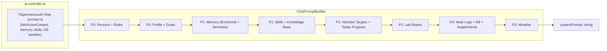

# VITOGRAPH — Prompt Architecture

> **Дата актуальности:** 17 апреля 2026

---

## 1. Обзор

System prompt для чата собирается через **ChatPromptBuilder** — fluent builder с приоритетными секциями.

Файл: `apps/api/src/ai/src/prompts/chat-prompt-builder.ts`



---

## 2. Секции и приоритеты

| Метод | Приоритет | Режим | Объём |
|:------|:----------|:------|:------|
| `withPersona(aiName, date, time)` | P0 | Оба | ~3500 символов |
| `withProfile(profile)` | P0 | Оба | ~500 символов |
| `withEmotionalContext(profile)` | P1 | Оба | ~300 символов |
| `withSemanticMemory(memories)` | P1 | Оба | ~600 символов |
| `withActiveSkills(skills)` | P1 | Оба | ~800 символов |
| `withKnowledgeBaseContext(results)` | P1 | Оба | ~1500 символов |
| `withNutritionTargets(targets)` | P1 | Diary | ~800 символов |
| `withTodayProgress(meals, tz)` | P1 | Оба | ~600 символов |
| `withLabReport(profile, isDeepDive)` | P1 | Assistant | ~2000 символов |
| `withMealLogs(meals, tz)` | P2 | Diary | ~1500 символов |
| `withKnowledgeBases(kbs)` | P2 | Оба | ~800 символов |
| `withSupplementProtocol(profile)` | P2 | Оба | ~600 символов |
| `withTodaySupplements(logs, tz)` | P2 | Оба | ~300 символов |
| `withWeatherAlert(alert)` | P3 | Оба | ~200 символов |

---

## 3. Ключевые правила персоны (withPersona)

Встроены прямо в промпт как константные инструкции:

- **CORE PERSONA & TONE:** строгий, заботливый ментор с юмором, эмоциями и характером
- **БОГАТСТВО ЯЗЫКА:** широкий спектр идиом, поговорок, метафор — активно используется
- **АНТИПОВТОР (STRICT):** нельзя повторять одну и ту же метафору дважды в диалоге; встроен стоп-лист слов-костылей с альтернативами
- **MICRONUTRIENT SPAM RULE:** в тексте ответа — только макросы (КБЖУ). Микронутриенты — исключительно в `<nutr type="micro">` тегах в TECHNICAL BLOCK
- **FLUIDITY:** запрещён любой markdown в ответах (нет `###`, `**`, `-`, `1.`); только русский текст + `<nutr>` / `<meal_score>` теги
- **APP BOUNDARIES:** запрещено ссылаться на внешние ресурсы, сайты, приложения
- **NAME BOUNDARIES:** запрещено представляться по имени

---

## 4. Режимы работы

| Режим | Активные секции | Активные инструменты |
|:------|:----------------|:--------------------|
| `assistant` | Persona, Profile, Memory, Skills, KB, Lab Report, KB Articles, Supplements, Weather | `calculate_biomarker_norms`, `update_user_profile`, `save_memory_fact` |
| `diary` | Persona, Profile, Memory, Nutrition Targets, Today Progress, Meal Logs, Supplements | `log_meal`, `log_supplement_intake`, `get_today_diary_summary`, `save_memory_fact` |

---

## 5. Result format

```typescript
interface PromptBuildResult {
  systemPrompt: string;
  estimatedTokens: number;
  includedSections: string[];
  version: string;
}
```
