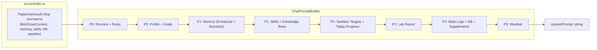

# VITOGRAPH — Prompt Architecture

> **Дата актуальности:** 20 апреля 2026 (обновлено: withGlycemicTimeline)

---

## 1. Обзор

System prompt для чата собирается через **ChatPromptBuilder** — fluent builder с приоритетными секциями.

Файл: `apps/api/src/ai/src/prompts/chat-prompt-builder.ts`



---

## 2. Секции и приоритеты

> **PROMPT_VERSION:** `1.2.0`

| Метод | Приоритет | Режим | Объём |
|:------|:----------|:------|:------|
| `withPersona(aiName, date, time)` | P0 | Оба | ~3500 символов |
| `withProfile(profile)` | P0 | Оба | ~500 символов |
| `withDietaryRestrictions(text)` | P0 | Оба | ~300 символов |
| `withHealthGoals(text)` | P0 | Оба | ~200 символов |
| `withGoalManagement()` | P0 | Оба | ~800 символов |
| `withActiveSkills(skills, userDateStr)` | **P0** | Оба | ~800+ символов |
| `withCoachingMode(skills, isFirstMsg)` | P0 | Assistant | ~600 символов |
| `withSkillDocument(matchedSkill)` | P0 | Оба | ~1200 символов |
| `withDiaryMode()` / `withAssistantMode()` | P0 | По режиму | ~300 символов |
| `withDiarySecurityRule()` | P0 | Diary | ~200 символов |
| `withEmotionalContext(profile)` | P1 | Оба | ~300 символов |
| `withSemanticMemory(memories)` | P1 | Оба | ~600 символов |
| `withPastActions(actions)` | P1 | Оба | ~400 символов |
| `withChronicConditions(text)` | P1 | Оба | ~300 символов |
| `withTestResults(text)` | P1 | Оба | ~500 символов |
| `withNutritionTargets(targets)` | P1 | Diary | ~800 символов |
| `withTodayProgress(meals, tz)` | P1 | Оба | ~600 символов |
| `withFoodZones(text)` | P1 | Оба | ~300 символов |
| `withGlycemicTimeline(timeline)` | P1 | Diary | ~800 символов |
| `withLabReport(text)` | P1 | Assistant | ~2000 символов |
| `withDeficitAwareRule()` | P1 | Diary | ~400 символов |
| `withMealLogs(meals)` | P2 | Diary | ~1500 символов |
| `withKnowledgeBases(kbs)` | P2 | Оба | ~800 символов |
| `withSupplementProtocol(text)` | P2 | Оба | ~600 символов |
| `withKnowledgeBase(results)` | P2 | Оба | ~1500 символов |
| `withTodaySupplements(logs)` | P2 | Оба | ~300 символов |
| `withWeatherAlert(alert)` | P3 | Оба | ~200 символов |

---

## 3. Ключевые правила персоны (withPersona)

Встроены прямо в промпт как константные инструкции:

- **CORE PERSONA & TONE:** строгий, заботливый ментор с юмором, эмоциями и характером
- **БОГАТСТВО ЯЗЫКА:** широкий спектр идиом, поговорок, метафор — активно используется
- **АНТИПОВТОР (STRICT):** нельзя повторять одну и ту же метафору дважды в диалоге; встроен стоп-лист слов-костылей с альтернативами
- **MICRONUTRIENT SPAM RULE:** в тексте ответа — фокус исключительно на гликемическом отклике и буферизации (Insulin Surfing). Микронутриенты — исключительно в `<nutr type="micro">` тегах в TECHNICAL BLOCK
- **FLUIDITY:** запрещён любой markdown в ответах (нет `###`, `**`, `-`, `1.`); только русский текст + `<nutr>` / `<meal_score>` теги
- **APP BOUNDARIES:** запрещено ссылаться на внешние ресурсы, сайты, приложения
- **NAME BOUNDARIES:** запрещено представляться по имени

---

## 4. Режимы работы

| Режим | Активные секции | Активные инструменты |
|:------|:----------------|:--------------------|
| `assistant` | Persona, Profile, Memory, Skills, KB, Lab Report, KB Articles, Supplements, Weather, Coaching, SkillDocument | `calculate_biomarker_norms`, `update_user_profile`, `get_today_diary_summary`, `manage_health_goals`, `log_assistant_action` |
| `diary` | Persona, Profile, Memory, Nutrition Targets, Today Progress, Meal Logs, Supplements, DeficitRule | `calculate_biomarker_norms`, `update_user_profile`, `log_meal`, `log_supplement_intake`, `get_today_diary_summary`, `log_assistant_action` |

---

## 5. Result format

```typescript
interface PromptBuildResult {
  systemPrompt: string;
  includedSections: string[];
  version: string; // currently "1.2.0"
}
```

---

## 6. Hotfix: Темпоральные правила (v1.2.0)

`withActiveSkills()` теперь получает параметр `userDateStr` (timezone-aware) и генерирует предрасчёт дней:

```
📍 Текущий шаг 1: В течение 3 дней отслеживать продукты
⏱️ Шаг активен: 2 дн. (с 15.04.2026)
📅 День 3 из 3
```

Добавленные правила в SKILL JOURNEY RULES:

| # | Правило | Описание |
|:--|:--------|:---------|
| 6 | ⏱️ TIME-AWARE RULE | LLM использует предрасчитанные `День X из Y`, а не самостоятельный пересчёт. При "СРОК ВЫПОЛНЕН" → advance_step. |
| 7 | 🧠 ANTI-AMNESIA RULE | LLM обязан доверять данным ⏱️/📅 больше, чем своей памяти из чата (окно ограничено 12 сообщениями). |
