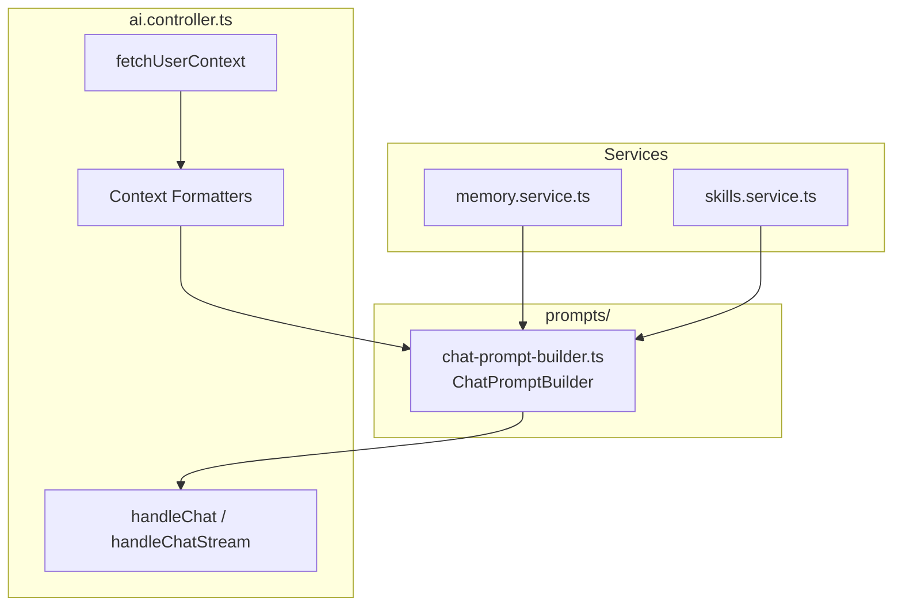

# VITOGRAPH — Prompt Architecture

> **Дата актуальности:** 7 апреля 2026
> **Статус:** Production. ChatPromptBuilder — единственный источник истины для всех system-промптов.

---

## 1. Архитектура

ChatPromptBuilder — единственный источник истины для всех system-промптов. Все редактирования персоны, правил и форматирования делаются только здесь, не в `ai.controller.ts`.



---

## 2. ChatPromptBuilder — Интерфейс

```typescript
interface PromptBuildResult {
  systemPrompt: string;
  includedSections: string[];
  version: string;
}

class ChatPromptBuilder {
  constructor(private mode: "assistant" | "diary") {}
  
  // ─── Core Persona (включается всегда) ───────────────────
  withPersona(aiName: string, userDateStr: string, userTimeStr: string): this;
  
  // ─── Memory Layers ──────────────────────────────────────
  withEmotionalContext(profile: {
    current_mood: string; mood_trend: string; trust_level: number;
  } | null): this;
  withSemanticMemory(memories: Array<{
    content: string; memory_type: string;
  }> | null): this;
  withPastActions(actions: Array<{ content: string }> | null): this;
  
  // ─── Goals & Skills ─────────────────────────────────────
  withActiveSkills(skills: Array<{
    skill_name: string; current_step: object; status: string;
  }>): this;
  withHealthGoals(goalsText: string): this;
  withGoalManagement(): this;
  withCoachingMode(
    activeSkills: Array<any>,
    isFirstMessageOfDay: boolean
  ): this;
  withSkillDocument(matchedSkill: {
    skill_name: string; skill_document: string;
  }): this;
  
  // ─── User Context ───────────────────────────────────────
  withProfile(profileText: string): this;
  withDietaryRestrictions(restrictionsText: string): this;
  withChronicConditions(conditionsText: string): this;
  withHistorySynopsis(synopsisText: string): this;
  withTestResults(testsText: string): this;
  withNutritionTargets(targetsText: string): this;
  withTodayProgress(progressText: string, sectionTitle?: string): this;
  withMealLogs(logsText: string): this;
  withFoodZones(zonesText: string): this;
  withLabReport(reportText: string): this;
  withKnowledgeBases(kbText: string): this;
  withSupplementProtocol(protocolText: string): this;
  withTodaySupplements(supplementsText: string): this;
  withWeatherAlert(alertText: string): this;
  
  // ─── Mode-Specific ─────────────────────────────────────
  withDiaryMode(): this;
  withDiarySecurityRule(): this;
  withAssistantMode(): this;
  withDeficitAwareRule(): this;
  
  // ─── Build ──────────────────────────────────────────────
  build(): PromptBuildResult;
}
```

---

## 3. Tone of Voice — XML-структура

Блок `CORE PERSONA & TONE` использует явные XML-теги для управления вниманием LLM. Это исключает «Few-Shot Bias» и «White Monkey Effect» при задании тона.

```xml
<persona>
Ты — Senior-ментор по здоровью. Стиль: прагматичная забота, высокий 
профессионализм и лёгкая тёплая ирония. Общение на равных.
</persona>

<metaphor_framework>
Аналогии строятся ИСКЛЮЧИТЕЛЬНО на:
- Инженерии и механике (износ деталей, нагрузки).
- Физике и термодинамике (КПД, разрядка батареи).
- Реальной логистике (навигация, планирование).
Метафора должна вытекать из текущего контекста разговора.
</metaphor_framework>

<quality_constraints>
- Freshness: каждая аналогия создаётся с нуля, клише запрещены.
- Достоинство: юмор на точных наблюдениях, не на гиперболах.
- Коррекция через иронию: отговаривай через здравый смысл, не через лекции.
</quality_constraints>
```

---

## 4. Приоритеты секций

| Приоритет | Секция | Режим | Примечание |
|-----------|--------|-------|------------|
| P0 | Persona + Rules | Оба | ~3500 символов |
| P0 | Profile + Restrictions | Оба | ~500 |
| P0 | Skill Document (`withSkillDocument`) | Оба | ~800, персонализированный протокол |
| P1 | Active Skills (current step) | Оба | ~200, FSM goal journeys |
| P1 | Goal Management rules | Assistant | FSM transition rules |
| P1 | Coaching Mode (MI) | Assistant | Motivational Interviewing |
| P1 | Emotional Context (Layer 3) | Оба | mood, trend, trust |
| P1 | Semantic Memory (Layer 2) | Оба | ~600, relevant facts |
| P1 | Past Actions (anti-repetition) | Оба | ~300, episodic memory |
| P1 | Nutrition Targets | Diary | ~800, детерминированные нормы |
| P1 | Today Progress | Оба | ~600 |
| P1 | Lab Report (Tier 1 / Deep) | Assistant | ~2000 |
| P2 | Meal Logs (detailed) | Diary + Diet intent | ~1500 |
| P2 | Knowledge Bases | Оба | ~800 |
| P2 | Supplement Protocol | Оба | ~600 |
| P2 | Today Supplements | Оба | ~300 |
| P2 | Chronic Conditions | Оба | ~300 |
| P3 | Weather Alert | Оба | ~200 |
| P3 | Food Zones | Diary + Diet intent | ~800 |

---

## 5. Context Formatters (ai.controller.ts)

| Функция | Что форматирует |
|:---|:---|
| `formatTestResults()` | Последние анализы крови для системного промпта |
| `formatMealLogs()` | Сегодняшние приёмы пищи |
| `formatNutritionTargets()` | Детерминированные нормы КБЖУ + микро |
| `formatTodayProgress()` | Суммарное потребление нутриентов за сегодня |
| `formatDietaryRestrictions()` | Диетические ограничения из `lifestyle_markers` |
| `formatActiveKnowledgeBases()` | Активные медицинские базы знаний (диагнозы) |
| `formatActiveSupplementProtocol()` | Текущий протокол БАДов |
| `formatTodaySupplements()` | Логи приёма БАДов за сегодня |
| `formatLabDiagnosticReport()` | Последний диагностический отчёт |

---

## 6. Planned Improvements

### 6.1 Prompt Registry
Вынести все специализированные промпты (lab-diagnostic, food-vision, psychological) в отдельные `.prompt.ts` файлы с единым registry (`prompts/index.ts`).

### 6.2 Response Validators
Post-LLM проверки для каждого типа ответа:

```typescript
// Chat — no markdown headers, no bullet points, closed <nutr> tags
function validateChatResponse(text: string): ValidationResult;

// Lab Report — all biomarkers covered, food_zones non-empty
function validateLabReport(report, inputCount: number): ValidationResult;

// Food Vision — items or supplements present, calories >= 0
function validateFoodVision(result): ValidationResult;
```

### 6.3 Formatters Extraction
Вынести context formatters из `ai.controller.ts` в отдельный `formatters/` каталог для чистоты архитектуры.
