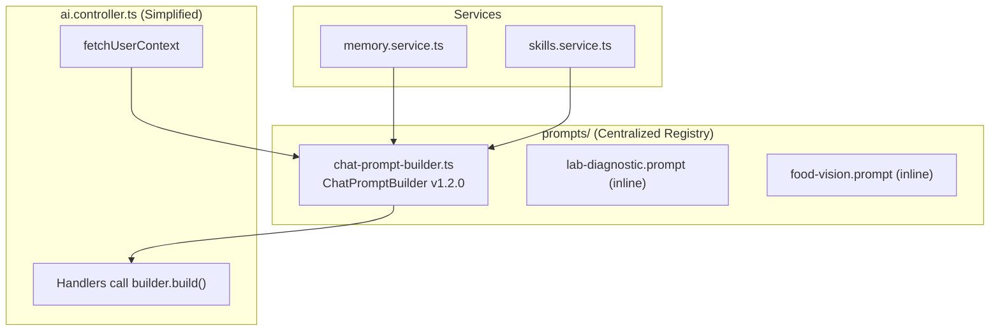
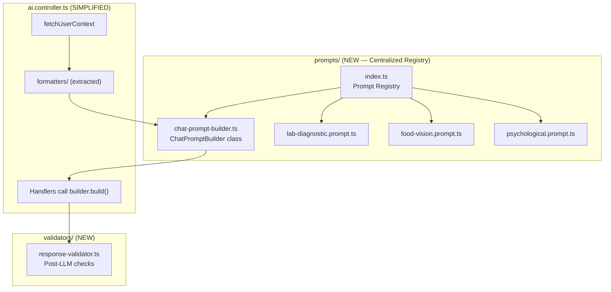

# VITOGRAPH — Prompt Architecture v2.0

> **Дата:** 6 апреля 2026  
> **Автор:** Maya (Lead Technical Architect)  
> **Статус:** ✅ Production-Ready. ChatPromptBuilder v1.2.0 внедрён, E2E-протестирован, в продакшѝне.

---

## 1. Текущее состояние (AS-IS)

ChatPromptBuilder — единственный источник истины для всех system-промптов. Все редактирования персоны, правил и форматирования делаются только здесь, не в `ai.controller.ts`.



---

## 2. Целевое состояние (TO-BE)



---

## 3. ChatPromptBuilder — Текущий модуль (AS-IS)

### 3.1 Интерфейс

```typescript
interface PromptBuildResult {
  systemPrompt: string;
  includedSections: string[];
  version: string; // текущая: "1.2.0"
}

class ChatPromptBuilder {
  private sections: PromptSection[];
  
  constructor(private mode: "assistant" | "diary") {}
  
  // Core persona (XML-структурированный ToV) — всегда включается
  withPersona(aiName: string, userDateStr: string, userTimeStr: string): this;
  
  // Context sections — адаптивно
  withProfile(profile: LeanProfile): this;
  withDietaryRestrictions(profile: any): this;
  withHealthGoals(profile: any): this;  // читает из user_active_skills
  withNutritionTargets(profile: any, kbs: any[]): this;
  withTodayProgress(meals: any[], tz: string): this;
  withMealLogs(meals: any[], tz: string): this;
  withLabReport(profile: any, isDeepDive: boolean): this;
  withKnowledgeBases(kbs: any[]): this;
  withSupplementProtocol(profile: any): this;
  withTodaySupplements(logs: any[], tz: string): this;
  withWeatherAlert(alert: string): this;
  withFoodZones(profile: any): this;
  
  // Phase 4: Memory layers — при наличии данных
  withEmotionalContext(profile: EmotionalProfile | null): this;
  withSemanticMemory(memories: SemanticMemory[] | null): this;
  
  // Phase 5: Skill Context — при наличии active_skills с документами
  withSkillContext(skillDocument: string): this;
  
  // Build
  build(): PromptBuildResult;
}
```

### 3.2 Tone of Voice — XML-структура (v2.0)

Блок `CORE PERSONA & TONE` использует явные XML-теги для управления вниманием LLM. Это исключает "Few-Shot Bias" и "White Monkey Effect" при задании тона.

```xml
<persona>
Ты — Senior-ментор по здоровью. Стиль: прагматичная забота, высокий профессионализм и лёгкая тёплая ирония. Общение на равных.
</persona>

<metaphor_framework>
Аналогии строятся ИСКЛЮЧИТЕЛЬНО на:
- Инженерии и механике (износ деталей, нагрузки).
- Физике и термодинамике (КПД, разрядка батареи).
- Реальной логистике (навигация, планирование).
Метафора должна вытекать из текущего контекста разговора.
</metaphor_framework>

<quality_constraints>
- Freshness: каждая аналогия создаётся с нуля, клише запрещены.
- Достоинство: юмор на точных наблюдениях, не на гиперболах.
- Коррекция через иронию: отговаривай через здравый смысл, не через лекции.
</quality_constraints>
```

### 3.3 Приоритеты секций

| Приоритет | Секция | Режим | Бюджет (символов) |
|-----------|--------|-------|-------------------|
| P0 | Persona + Rules | Оба | ~3500 |
| P0 | Profile + Restrictions | Оба | ~500 |
| P0 | **Skill Context** (`withSkillContext`) | Оба | ~800 |
| P1 | Health Goals | Оба | ~300 |
| P1 | **Emotional Context** (Layer 3, память) | Оба | ~300 |
| P1 | **Semantic Memory** (Layer 2, память) | Оба | ~600 |
| P1 | Nutrition Targets | Diary | ~800 |
| P1 | Today Progress | Оба | ~600 |
| P1 | Lab Report (Tier 1 / Deep) | Assistant | ~2000 |
| P2 | Meal Logs (detailed) | Diary + Diet intent | ~1500 |
| P2 | Knowledge Bases | Оба | ~800 |
| P2 | Supplement Protocol | Оба | ~600 |
| P2 | Today Supplements | Оба | ~300 |
| P3 | Weather Alert | Оба | ~200 |
| P3 | Food Zones | Diary + Diet intent | ~800 |

---

## 4. Few-Shot Examples — Что добавить

### 4.1 Food Vision (в `food-vision.prompt.ts`)

Добавить 2 примера: один для обычной еды, один для БАДов.

### 4.2 Chat TECHNICAL BLOCK (в persona builder)

Добавить 1 пример идеального ответа с правильными `<nutr>` тегами, `<meal_score>` и TECHNICAL BLOCK.

---

## 5. Response Validators

### 5.1 Chat Validator

```typescript
function validateChatResponse(text: string): ValidationResult {
  // 1. No markdown headers (###, ##)
  // 2. No bullet points (-, *)
  // 3. All <nutr> tags properly closed
  // 4. No <nutr type="micro"> in narrative (only in tech block)
  // 5. No "[Image of...]" placeholders
  // 6. Language is Russian
}
```

### 5.2 Lab Report Validator

```typescript  
function validateLabReport(report: LabDiagnosticReport, inputCount: number): ValidationResult {
  // 1. biomarker_assessments.length >= inputCount
  // 2. food_zones.red.length > 0 (never empty)
  // 3. food_zones.green.length > 0 (never empty)
  // 4. All required fields non-empty
}
```

### 5.3 Food Vision Validator

```typescript
function validateFoodVision(result: FoodRecognitionOutput): ValidationResult {
  // 1. items.length > 0 OR supplements.length > 0
  // 2. All calories >= 0
  // 3. All weight_g > 0
  // 4. health_reaction is non-empty Russian text
}
```
