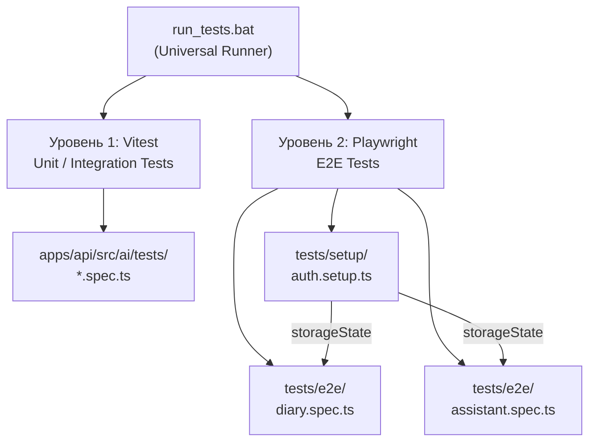

# VITOGRAPH — Testing Infrastructure

> **Дата актуальности:** 29 марта 2026
>
> Документация по системе тестирования: Vitest (unit/integration) + Playwright (E2E).

---

## 1. Обзор архитектуры тестирования



| Уровень | Framework | Конфиг | Назначение |
|:--------|:----------|:-------|:-----------|
| **Unit / Integration** | Vitest 3 | `apps/api/src/ai/vitest.config.ts` | Тесты логики AI Backend (tools, sanitizer, алгоритмы) |
| **E2E** | Playwright | `apps/web/playwright.config.ts` | Тесты UI через headless Chromium |

---

## 2. Vitest (Backend)

### Конфигурация

Файл: [`vitest.config.ts`](file:///c:/project/VITOGRAPH/apps/api/src/ai/vitest.config.ts)

```typescript
export default defineConfig({
  test: {
    environment: 'node',
    include: ['tests/**/*.spec.ts'],
  },
});
```

### Запуск

```bash
cd apps/api/src/ai
npx vitest run
```

### npm script

`package.json` → `"test": "vitest run"` (Vitest `^3.0.5`)

### Текущие тесты

| Файл | Описание | Статус |
|:-----|:---------|:-------|
| `tests/logic.spec.ts` | Sanity check (scaffold) | ⚠️ Только заготовка |

> **TODO:** Добавить реальные unit-тесты для:
> - `sanitizeMessages()` (builder.ts)
> - `logMealTool` (tools.ts)
> - `calculateNormsTool` (tools.ts)
> - `get_today_diary_summary` (tools.ts)
> - `computeDeterministicMicros` (ai.controller.ts)

---

## 3. Playwright (E2E)

### Конфигурация

Файл: [`playwright.config.ts`](file:///c:/project/VITOGRAPH/apps/web/playwright.config.ts)

| Параметр | Значение |
|:---------|:---------|
| `testDir` | `./tests` |
| `timeout` | 600,000ms (10 минут — учитывает LLM thinking time) |
| `fullyParallel` | `false` |
| `workers` | 1 (избежание state collision) |
| Browser | Chromium (headless) |
| `baseURL` | `http://localhost:3000` |
| `reuseExistingServer` | `true` |
| `reporter` | HTML |

### Auth Setup

Файл: [`auth.setup.ts`](file:///c:/project/VITOGRAPH/apps/web/tests/setup/auth.setup.ts)

Авторизация выполняется 1 раз и сохраняется в Storage State:

| Поле | Значение |
|:-----|:---------|
| Email | `test1@test.com` |
| Password | `12332100` |
| Storage state | `playwright/.auth/user.json` |

Все E2E-тесты зависят от `setup` project (Playwright dependencies).

### Текущие E2E-тесты

#### `diary.spec.ts` — Дневник питания

1. Переход на `/?tab=diary`
2. Ожидание загрузки панели (`Калории за день`, timeout 15s)
3. Заполнение формы: уникальное имя блюда + вес 150г
4. Клик «Отправить»
5. Проверка: блюдо появляется в списке (timeout 15s)

#### `assistant.spec.ts` — AI Ассистент

1. Переход на `/?tab=assistant`
2. Ввод: «Привет, сколько калорий я сегодня съел?»
3. Клик «Отправить»
4. Проверка: сообщение отображается
5. Ожидание: loading-индикатор скрывается (timeout **300s** — 5 минут для LLM)
6. Проверка: `.assistant-content` содержит текст > 10 символов

### Запуск

```bash
cd apps/web
npx playwright test --project=chromium
```

> ⚠️ **Требует работающих серверов:** Next.js (3000) + Node.js AI (3001). Playwright НЕ стартует сервера, только переиспользует (`reuseExistingServer: true`).

---

## 4. Universal Test Runner

Файл: [`run_tests.bat`](file:///c:/project/VITOGRAPH/run_tests.bat)

```
[Опциональный Restart серверов (Y/N)]
     ↓
[1/2] vitest run (apps/api/src/ai/)
     ↓ (fail → exit)
[Port Check] 3000 + 3001
     ↓ (fail → exit "Servers are down")
[2/2] playwright test --project=chromium
     ↓ (fail → exit)
[SUCCESS] ALL TESTS PASSED
```

### Запуск

```bash
run_tests.bat
```

---

## 5. Ключевые таймауты

| Контекст | Таймаут | Обоснование |
|:---------|:--------|:------------|
| Playwright global | 600,000ms | Gemini 3.1 Thinking может «думать» до 6 минут |
| AI Assistant ответ | 300,000ms | Ожидание исчезновения `.animate-bounce` |
| UI элементы | 10,000-15,000ms | Загрузка панели / рендер компонентов |
| Vitest | default | Unit-тесты без сети |

---

## 6. Добавление новых тестов (Guide)

### Unit-тест (Vitest)

```typescript
// apps/api/src/ai/tests/my-test.spec.ts
import { describe, it, expect } from 'vitest';

describe('My Feature', () => {
  it('should do something', () => {
    expect(myFunction(input)).toBe(expectedOutput);
  });
});
```

### E2E-тест (Playwright)

```typescript
// apps/web/tests/e2e/my-feature.spec.ts
import { test, expect } from '@playwright/test';

test.describe('My Feature', () => {
  test('should work', async ({ page }) => {
    await page.goto('/?tab=diary');
    // Auth уже настроена через storageState
    await expect(page.getByText('Expected Text')).toBeVisible({ timeout: 15000 });
  });
});
```
